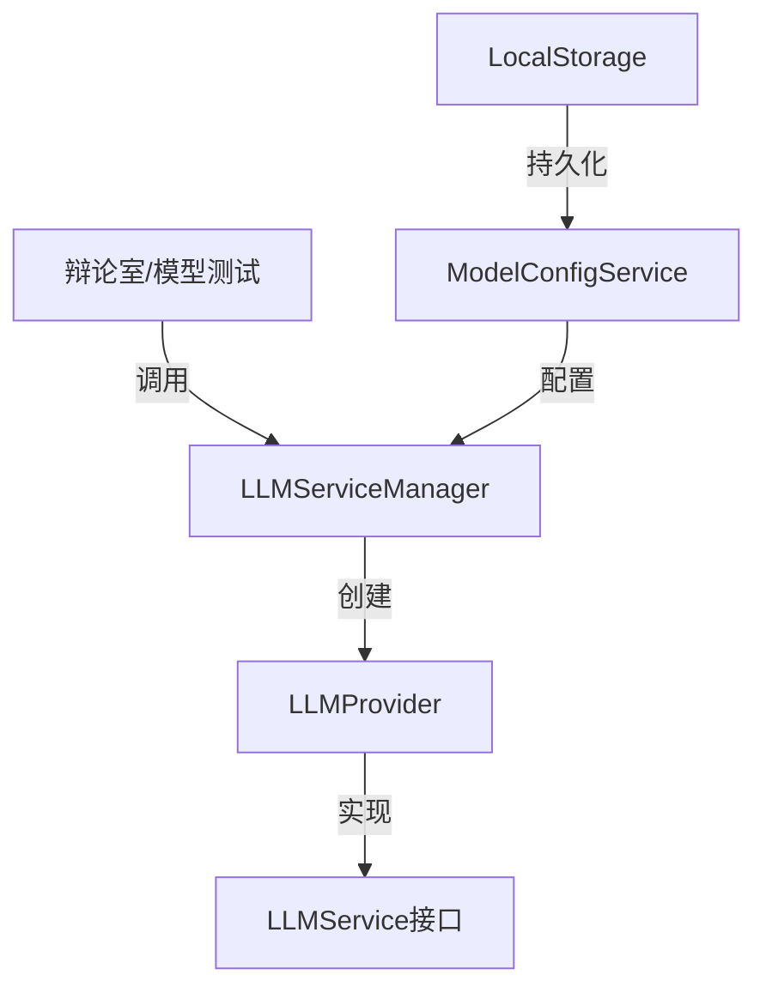

# LLM服务设计文档

## 目录
- [架构设计](#架构设计)
- [数据结构](#数据结构)
- [接口定义](#接口定义)
- [存储设计](#存储设计)
- [实现细节](#实现细节)

## 架构设计

### 整体架构


### 分层设计
1. 应用层
   - 辩论室服务 (AIDebateService)
   - 模型测试面板 (ModelTestPanel)

2. 服务层
   - LLM服务管理器 (LLMServiceManager)
   - 模型配置服务 (ModelConfigService)

3. 提供商层
   - Ollama提供商 (OllamaProvider)
   - Deepseek提供商 (DeepseekProvider)
   - 其他提供商实现

4. 基础设施层
   - 存储服务 (StorageService)
   - 配置管理 (ConfigManager)

## 数据结构

### 1. 基础类型定义
```typescript
// src/modules/llm/types/index.ts

export interface LLMRequest {
  prompt: string;
  input: string;
  modelConfig: ModelConfig;
  parameters?: {
    temperature?: number;
    maxTokens?: number;
    topP?: number;
    frequencyPenalty?: number;
    presencePenalty?: number;
    stop?: string[];
  };
}

export interface LLMResponse {
  content: string;
  usage?: {
    promptTokens: number;
    completionTokens: number;
    totalTokens: number;
  };
  metadata?: Record<string, any>;
}

export interface LLMService {
  generateCompletion(request: LLMRequest): Promise<LLMResponse>;
  generateStream?(request: LLMRequest): AsyncIterator<string>;
}

export interface LLMProvider extends LLMService {
  validateConfig(): Promise<boolean>;
  listModels?(): Promise<string[]>;
}
```

### 2. 提供商特定配置
```typescript
// src/modules/llm/types/providers.ts

export interface OllamaConfig {
  baseUrl: string;
  model: string;
  options?: {
    temperature?: number;
    top_p?: number;
    num_predict?: number;
    stop?: string[];
    useLocalEndpoint?: boolean;
  };
}

export interface DeepseekConfig {
  baseUrl: string;
  apiKey: string;
  model: string;
  organizationId?: string;
  options?: {
    temperature?: number;
    maxTokens?: number;
    topP?: number;
  };
}

// ... 其他提供商配置
```

### 3. 错误处理
```typescript
// src/modules/llm/types/error.ts

export enum LLMErrorCode {
  INVALID_CONFIG = 'INVALID_CONFIG',
  API_ERROR = 'API_ERROR',
  RATE_LIMIT = 'RATE_LIMIT',
  TIMEOUT = 'TIMEOUT',
  UNKNOWN = 'UNKNOWN'
}

export class LLMError extends Error {
  constructor(
    message: string,
    public code: LLMErrorCode,
    public provider: string,
    public cause?: Error
  ) {
    super(message);
    this.name = 'LLMError';
  }
}
```

## 接口定义

### 1. LLM服务管理器
```typescript
// src/modules/llm/services/LLMServiceManager.ts

export class LLMServiceManager {
  private static instance: LLMServiceManager;
  private providerInstances: Map<string, LLMProvider>;
  private modelConfigService: ModelConfigService;

  static getInstance(): LLMServiceManager;
  async getProvider(modelConfig: ModelConfig): Promise<LLMProvider>;
  private createProvider(modelConfig: ModelConfig): Promise<LLMProvider>;
}
```

### 2. 提供商实现
```typescript
// src/modules/llm/providers/ollama/OllamaProvider.ts

export class OllamaProvider implements LLMProvider {
  constructor(private config: OllamaConfig) {}
  
  async generateCompletion(request: LLMRequest): Promise<LLMResponse>;
  async generateStream(request: LLMRequest): AsyncIterator<string>;
  async validateConfig(): Promise<boolean>;
}

// src/modules/llm/providers/deepseek/DeepseekProvider.ts

export class DeepseekProvider implements LLMProvider {
  constructor(private config: DeepseekConfig) {}
  
  async generateCompletion(request: LLMRequest): Promise<LLMResponse>;
  async generateStream(request: LLMRequest): AsyncIterator<string>;
  async validateConfig(): Promise<boolean>;
}
```

## 存储设计

### 1. 模型配置存储
```typescript
// src/modules/llm/storage/types.ts

interface ModelConfigStorage {
  configs: {
    [configId: string]: ModelConfig;
  };
  providers: {
    [providerId: string]: ProviderConfig;
  };
  defaultConfig?: string;
}

// src/modules/llm/storage/ModelConfigService.ts

export class ModelConfigService {
  private storage: StorageService;
  
  async getConfig(id: string): Promise<ModelConfig>;
  async saveConfig(config: ModelConfig): Promise<void>;
  async listConfigs(): Promise<ModelConfig[]>;
  async setDefaultConfig(id: string): Promise<void>;
  async getDefaultConfig(): Promise<ModelConfig | null>;
}
```

### 2. 持久化实现
```typescript
// src/modules/llm/storage/StorageService.ts

export class StorageService {
  private readonly STORAGE_KEY = 'llm_configs';
  
  async load(): Promise<ModelConfigStorage>;
  async save(data: ModelConfigStorage): Promise<void>;
  private validate(data: unknown): asserts data is ModelConfigStorage;
}
```

## 实现细节

### 1. 提供商工厂
```typescript
// src/modules/llm/providers/ProviderFactory.ts

export class ProviderFactory {
  static createProvider(config: ModelConfig): LLMProvider {
    switch (config.provider) {
      case 'ollama':
        return new OllamaProvider(config.providerSpecific as OllamaConfig);
      case 'deepseek':
        return new DeepseekProvider(config.providerSpecific as DeepseekConfig);
      default:
        throw new Error(`Unsupported provider: ${config.provider}`);
    }
  }
}
```

### 2. 配置验证
```typescript
// src/modules/llm/validation/schemas.ts

import { z } from 'zod';

export const modelConfigSchema = z.object({
  id: z.string().uuid(),
  name: z.string().min(1),
  provider: z.enum(['ollama', 'deepseek', /* other providers */]),
  model: z.string(),
  parameters: z.object({
    temperature: z.number().min(0).max(2).optional(),
    maxTokens: z.number().min(1).optional(),
    topP: z.number().min(0).max(1).optional()
  }).optional(),
  providerSpecific: z.record(z.any())
});
```

### 3. 错误处理
```typescript
// src/modules/llm/utils/errorHandler.ts

export class LLMErrorHandler {
  static handle(error: unknown, provider: string): LLMError {
    if (error instanceof LLMError) {
      return error;
    }
    
    // 处理不同类型的错误
    if (error instanceof Error) {
      if (error.message.includes('rate limit')) {
        return new LLMError(
          'Rate limit exceeded',
          LLMErrorCode.RATE_LIMIT,
          provider,
          error
        );
      }
      // ... 其他错误类型处理
    }
    
    return new LLMError(
      'Unknown error occurred',
      LLMErrorCode.UNKNOWN,
      provider,
      error as Error
    );
  }
}
```

## 使用示例

### 1. 在辩论室中使用
```typescript
// src/modules/debate/services/AIDebateService.ts

export class AIDebateService {
  private llmManager = LLMServiceManager.getInstance();
  
  async generateInnerThoughts(character: Character, state: DebateState) {
    const modelConfig = await this.modelConfigService.getById(character.config.modelId);
    const provider = await this.llmManager.getProvider(modelConfig);
    
    const response = await provider.generateCompletion({
      prompt: this.buildInnerThoughtsPrompt(character, state),
      input: '',
      modelConfig,
      parameters: {
        temperature: 0.8,
        maxTokens: 500
      }
    });
    
    return response.content;
  }
}
```

### 2. 在模型测试中使用
```typescript
// src/modules/model/components/ModelTestPanel.tsx

export const ModelTestPanel: React.FC<Props> = ({ modelConfig }) => {
  const llmManager = LLMServiceManager.getInstance();
  
  const handleTest = async (input: string) => {
    const provider = await llmManager.getProvider(modelConfig);
    const response = await provider.generateCompletion({
      prompt: "You are a helpful assistant.",
      input,
      modelConfig
    });
    // 处理响应...
  };
}
```

## 配置示例

### 1. Ollama配置
```json
{
  "id": "ollama-local",
  "name": "本地Ollama模型",
  "provider": "ollama",
  "model": "deepseek-coder",
  "parameters": {
    "temperature": 0.7,
    "maxTokens": 2000
  },
  "providerSpecific": {
    "baseUrl": "http://localhost:11434",
    "useLocalEndpoint": true
  }
}
```

### 2. Deepseek配置
```json
{
  "id": "deepseek-chat",
  "name": "Deepseek聊天模型",
  "provider": "deepseek",
  "model": "deepseek-chat",
  "parameters": {
    "temperature": 0.8,
    "maxTokens": 1000
  },
  "providerSpecific": {
    "baseUrl": "https://api.deepseek.com/v1",
    "apiKey": "YOUR_API_KEY",
    "organizationId": "YOUR_ORG_ID"
  }
}
```

## 注意事项

1. 配置安全性
   - API密钥等敏感信息需要加密存储
   - 避免在日志中打印敏感信息
   - 定期轮换密钥

2. 错误处理
   - 实现完整的错误追踪
   - 添加重试机制
   - 提供用户友好的错误提示

3. 性能优化
   - 缓存Provider实例
   - 实现请求队列
   - 添加超时处理

4. 可扩展性
   - 保持接口统一
   - 支持动态加载提供商
   - 预留自定义配置空间

## 待优化项目

1. 功能增强
   - [ ] 添加流式输出支持
   - [ ] 实现模型自动选择
   - [ ] 添加响应解析器

2. 性能优化
   - [ ] 添加请求缓存
   - [ ] 优化配置加载
   - [ ] 实现批量请求

3. 监控与日志
   - [ ] 添加性能监控
   - [ ] 完善日志记录
   - [ ] 实现使用统计

## 技术栈

1. 核心技术
   - TypeScript
   - React
   - IndexedDB/LocalStorage
   - WebSocket (流式输出)

2. 工具库
   - Zod (数据验证)
   - Axios (HTTP请求)
   - crypto-js (加密存储)

3. 开发工具
   - ESLint
   - Jest
   - TypeDoc 

## 新提供商实现指南

### 1. 实现步骤

1. 类型定义
```typescript
// 1. 在 src/modules/llm/types/providers.ts 中添加提供商配置接口
export interface NewProviderConfig {
  baseUrl: string;
  apiKey?: string;
  // 其他必要的认证信息
  model: string;
  options?: {
    // 模型特定参数
    temperature?: number;
    maxTokens?: number;
    // 其他可选参数
  };
}

// 2. 在 src/modules/llm/types/common.ts 中更新提供商枚举
export type ModelProvider = 
  | 'ollama'
  | 'deepseek'
  | 'new_provider'  // 添加新提供商
  | string;        // 保持开放性
```

2. 提供商实现
```typescript
// src/modules/llm/providers/new-provider/NewProvider.ts
import { LLMProvider, LLMRequest, LLMResponse } from '../../types';
import { NewProviderConfig } from '../../types/providers';
import { LLMError, LLMErrorCode } from '../../types/error';

export class NewProvider implements LLMProvider {
  constructor(private config: NewProviderConfig) {
    // 验证配置
    this.validateConfig();
  }

  async generateCompletion(request: LLMRequest): Promise<LLMResponse> {
    try {
      // 1. 转换请求格式
      const apiRequest = this.transformRequest(request);
      
      // 2. 发送API请求
      const apiResponse = await this.sendRequest(apiRequest);
      
      // 3. 转换响应格式
      return this.transformResponse(apiResponse);
    } catch (error) {
      // 4. 错误处理
      throw LLMErrorHandler.handle(error, 'new_provider');
    }
  }

  async generateStream(request: LLMRequest): AsyncIterator<string> {
    // 实现流式输出
    // 如果不支持，可以不实现此方法
  }

  async validateConfig(): Promise<boolean> {
    // 实现配置验证
    if (!this.config.baseUrl) {
      throw new LLMError(
        'Base URL is required',
        LLMErrorCode.INVALID_CONFIG,
        'new_provider'
      );
    }
    // ... 其他验证
    return true;
  }

  private transformRequest(request: LLMRequest): any {
    // 将统一的请求格式转换为提供商特定格式
    return {
      // 根据API文档进行转换
    };
  }

  private transformResponse(apiResponse: any): LLMResponse {
    // 将提供商响应转换为统一格式
    return {
      content: apiResponse.text || '',
      usage: {
        promptTokens: apiResponse.usage?.prompt_tokens || 0,
        completionTokens: apiResponse.usage?.completion_tokens || 0,
        totalTokens: apiResponse.usage?.total_tokens || 0
      },
      metadata: {
        // 保存提供商特定的元数据
        provider: 'new_provider',
        model: this.config.model,
        // ...其他元数据
      }
    };
  }
}
```

3. 工厂注册
```typescript
// 更新 src/modules/llm/providers/ProviderFactory.ts
export class ProviderFactory {
  static createProvider(config: ModelConfig): LLMProvider {
    switch (config.provider) {
      // ... 现有提供商
      case 'new_provider':
        return new NewProvider(config.providerSpecific as NewProviderConfig);
      default:
        throw new Error(`Unsupported provider: ${config.provider}`);
    }
  }
}
```

4. 配置验证
```typescript
// 更新 src/modules/llm/validation/schemas.ts
export const newProviderConfigSchema = z.object({
  baseUrl: z.string().url(),
  apiKey: z.string().optional(),
  model: z.string(),
  options: z.object({
    temperature: z.number().min(0).max(2).optional(),
    maxTokens: z.number().min(1).optional(),
    // ... 其他参数验证
  }).optional()
});

// 更新 modelConfigSchema
export const modelConfigSchema = z.object({
  // ... 现有字段
  provider: z.enum(['ollama', 'deepseek', 'new_provider']),
  providerSpecific: z.union([
    // ... 现有提供商配置
    newProviderConfigSchema
  ])
});
```

### 2. 测试规范

1. 单元测试
```typescript
// src/modules/llm/providers/new-provider/__tests__/NewProvider.test.ts
describe('NewProvider', () => {
  // 配置验证测试
  describe('validateConfig', () => {
    it('should validate valid config', async () => {
      // ...
    });

    it('should throw on invalid config', async () => {
      // ...
    });
  });

  // 请求转换测试
  describe('transformRequest', () => {
    it('should transform request correctly', () => {
      // ...
    });
  });

  // 响应转换测试
  describe('transformResponse', () => {
    it('should transform response correctly', () => {
      // ...
    });
  });

  // 完整流程测试
  describe('generateCompletion', () => {
    it('should generate completion successfully', async () => {
      // ...
    });

    it('should handle API errors correctly', async () => {
      // ...
    });
  });
});
```

2. 集成测试
```typescript
// src/modules/llm/providers/new-provider/__tests__/integration.test.ts
describe('NewProvider Integration', () => {
  it('should work with LLMServiceManager', async () => {
    // ...
  });

  it('should work with ModelConfigService', async () => {
    // ...
  });
});
```

### 3. 文档要求

1. API文档
- 完整的API参数说明
- 请求/响应示例
- 错误码说明
- 速率限制说明

2. 配置文档
- 必要的配置项说明
- 可选配置项说明
- 配置示例
- 最佳实践建议

3. 使用文档
- 基本使用示例
- 流式输出示例（如果支持）
- 错误处理示例
- 性能优化建议

### 4. 检查清单

实现新提供商时，请确保完成以下检查项：

- [ ] 类型定义完整性
  - [ ] 配置接口定义
  - [ ] 请求/响应类型定义
  - [ ] 错误类型定义

- [ ] 核心功能实现
  - [ ] 基本对话生成
  - [ ] 流式输出（可选）
  - [ ] 配置验证
  - [ ] 错误处理

- [ ] 代码质量
  - [ ] TypeScript 类型完整
  - [ ] 代码注释完善
  - [ ] 遵循项目代码风格
  - [ ] 通过 lint 检查

- [ ] 测试覆盖
  - [ ] 单元测试
  - [ ] 集成测试
  - [ ] 错误场景测试
  - [ ] 性能测试

- [ ] 文档完整性
  - [ ] API 文档
  - [ ] 配置文档
  - [ ] 使用示例
  - [ ] 更新主文档

### 5. 性能考虑

1. 缓存策略
```typescript
export class NewProvider implements LLMProvider {
  private cache: Map<string, LLMResponse>;
  private cacheConfig: {
    enabled: boolean;
    ttl: number;
  };

  constructor(config: NewProviderConfig) {
    this.cache = new Map();
    this.cacheConfig = {
      enabled: config.options?.enableCache ?? false,
      ttl: config.options?.cacheTTL ?? 3600000 // 1小时
    };
  }

  private getCacheKey(request: LLMRequest): string {
    // 生成缓存键
    return JSON.stringify({
      prompt: request.prompt,
      input: request.input,
      model: this.config.model,
      parameters: request.parameters
    });
  }

  private async getFromCache(request: LLMRequest): Promise<LLMResponse | null> {
    if (!this.cacheConfig.enabled) return null;
    const key = this.getCacheKey(request);
    return this.cache.get(key) || null;
  }

  private setCache(request: LLMRequest, response: LLMResponse): void {
    if (!this.cacheConfig.enabled) return;
    const key = this.getCacheKey(request);
    this.cache.set(key, response);
    
    // 设置 TTL
    setTimeout(() => {
      this.cache.delete(key);
    }, this.cacheConfig.ttl);
  }
}
```

2. 重试机制
```typescript
export class NewProvider implements LLMProvider {
  private async withRetry<T>(
    operation: () => Promise<T>,
    retries: number = 3,
    delay: number = 1000
  ): Promise<T> {
    try {
      return await operation();
    } catch (error) {
      if (retries === 0 || !this.isRetryableError(error)) {
        throw error;
      }
      
      await new Promise(resolve => setTimeout(resolve, delay));
      return this.withRetry(operation, retries - 1, delay * 2);
    }
  }

  private isRetryableError(error: any): boolean {
    // 判断错误是否可重试
    return error instanceof LLMError && 
           (error.code === LLMErrorCode.RATE_LIMIT ||
            error.code === LLMErrorCode.TIMEOUT);
  }
}
```

3. 并发控制
```typescript
export class NewProvider implements LLMProvider {
  private semaphore: Semaphore;

  constructor(config: NewProviderConfig) {
    this.semaphore = new Semaphore(config.options?.maxConcurrent ?? 5);
  }

  async generateCompletion(request: LLMRequest): Promise<LLMResponse> {
    return this.semaphore.acquire(async () => {
      // 原有的生成逻辑
    });
  }
}
```

### 6. 监控与日志

1. 性能监控
```typescript
export class NewProvider implements LLMProvider {
  private metrics = {
    requestCount: 0,
    errorCount: 0,
    totalLatency: 0,
    tokenUsage: 0
  };

  private async trackMetrics<T>(
    operation: () => Promise<T>
  ): Promise<T> {
    const startTime = Date.now();
    try {
      const result = await operation();
      this.metrics.requestCount++;
      this.metrics.totalLatency += Date.now() - startTime;
      return result;
    } catch (error) {
      this.metrics.errorCount++;
      throw error;
    }
  }

  getMetrics() {
    return {
      ...this.metrics,
      averageLatency: this.metrics.totalLatency / this.metrics.requestCount,
      errorRate: this.metrics.errorCount / this.metrics.requestCount
    };
  }
}
```

2. 日志记录
```typescript
export class NewProvider implements LLMProvider {
  private logger: Logger;

  constructor(config: NewProviderConfig) {
    this.logger = new Logger('NewProvider');
  }

  private logRequest(request: LLMRequest): void {
    this.logger.debug('Request', {
      prompt: request.prompt.substring(0, 100),
      model: this.config.model,
      parameters: request.parameters
    });
  }

  private logResponse(response: LLMResponse): void {
    this.logger.debug('Response', {
      contentLength: response.content.length,
      usage: response.usage
    });
  }

  private logError(error: Error): void {
    this.logger.error('Error', {
      message: error.message,
      stack: error.stack,
      code: error instanceof LLMError ? error.code : 'UNKNOWN'
    });
  }
}
``` 