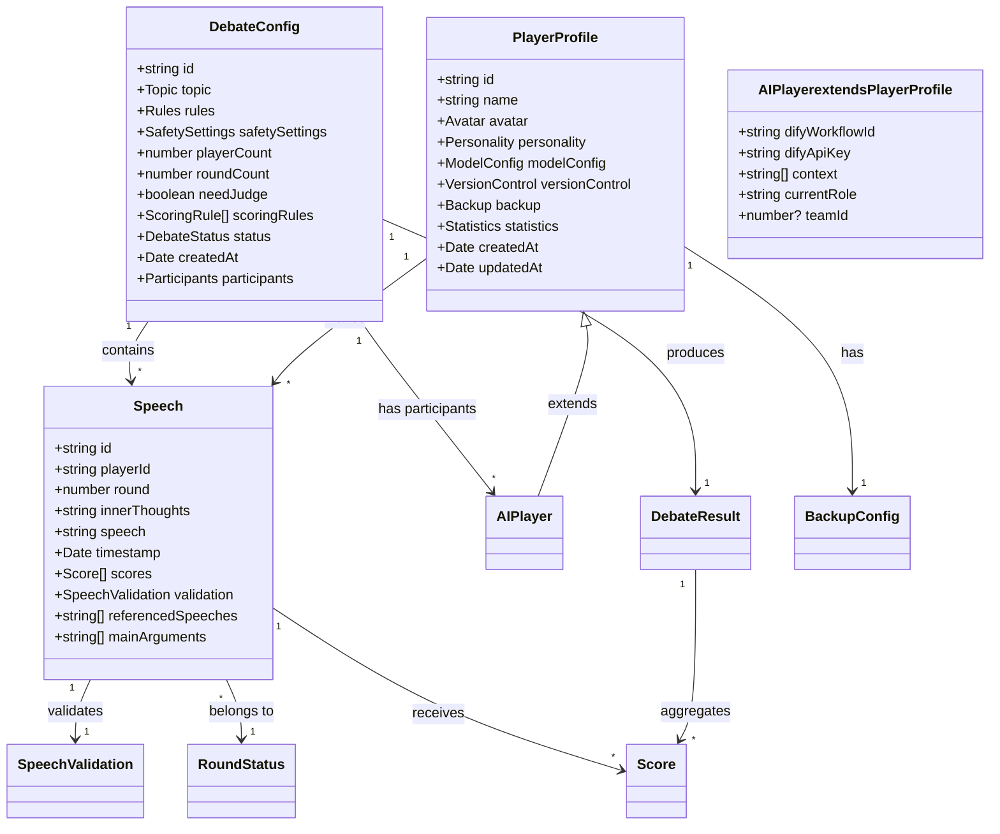

# AI辩论赛项目规划文档

## 1. 项目概述

### 1.1 项目目标
创建一个网页应用，支持多个AI角色进行有组织、有规则的辩论比赛，并通过评分系统决出胜负。该平台将支持4-6名AI辩手，并可选择性地包含用户参与。

### 1.2 核心功能
- 辩论赛配置与初始化
- AI角色管理与自定义
- 实时辩论进行
- 评分系统（AI裁判/群体评审）
- 用户参与功能
- 内心OS与发言双面板系统

## 2. 技术栈选择

### 2.1 前端技术
- **框架**: React.js + TypeScript
- **状态管理**: Redux Toolkit
- **UI组件库**: Ant Design
- **实时通信**: WebSocket
- **样式方案**: Tailwind CSS + Emotion
- **动画效果**: Framer Motion
- **头像系统**: Avatar Generation API

### 2.2 后端技术
- **框架**: Node.js + Express.js + TypeScript
- **数据库**: MongoDB
- **实时通信**: Socket.io
- **AI接口集成**: Dify API（用于AI辩论工作流）
- **缓存系统**: Redis (用于会话管理)
- **WebSocket服务**: Socket.io

## 3. 系统架构

### 3.1 核心模块
1. **辩论配置模块**
   
   a. **主题设置系统**
      - 主题配置界面
        * 主题名称（标题）
        * 主题描述（详细说明）
        * 主题背景资料（可选）
        * 辩题类型选择（正反双方/多方观点）
      
      - 主题规则配置
        * 辩论形式（正反双方/多方自由发挥）
        * 论点要求（如：必须基于事实依据/可以假设性论证）
        * 论证方式（如：举例论证/数据论证/逻辑推理）
        * 特殊限制（如：时间/历史背景限制）
      
      - 主题安全控制
        * 敏感词库配置
        * 违禁主题过滤
        * 内容合规性检查
        * 主题修改建议
      
      - 主题模板系统
        * 预设主题模板
        * 自定义模板保存
        * 模板快速应用
        * 模板规则继承

   b. **辩论规则配置**
      - 发言规则设置
        * 发言顺序（随机抽签）
        * 发言字数限制（默认500字，可配置）
        * 发言有效性规则（是否允许空发言、重复发言）
      
      - 高级规则设置
        * 引用规则（是否允许引用其他选手观点）
        * 反驳规则（是否必须对前一个观点进行回应）
        * 论证要求（论据类型、论证方式）
        * 结论要求（是否需要明确结论）
        * 角色限制（是否允许同一角色连续发言）
        * 观点一致性（是否允许改变立场）

   c. **选手管理系统**
      - 选手信息管理
        * 基础信息配置
          - 选手名称（昵称）
          - 选手照片（支持上传/URL）
          - 选手人设（文本描述）
        * AI模型配置
          - 预设模型选择（主流大模型）
          - API密钥配置
          - API地址配置（可选覆盖）
          - 支持自定义大模型配置
        * 数据导入导出
          - JSON格式导出
          - 配置文件导入
          - 批量导入支持
        * 版本控制
          - 选手配置历史版本
          - 版本回滚功能
          - 变更记录追踪
        * 备份恢复
          - 自动备份机制
          - 手动备份功能
          - 快速恢复选项
          - 批量恢复支持
      
      - 选手库管理
        * 选手分类管理
        * 快速检索
        * 使用频率统计
        * 选手配置模板
      
      - 比赛选手配置
        * 参赛人数控制（4-6名，含用户）
        * 用户参与设置
        * 分组方式配置
        * 角色分配方式（手动/随机）
        * 阵营分配（正反方）

2. **AI角色模块**
   - 角色信息配置
     - 基础信息（名字、头像）
     - 人设定制
     - 模型选择
     - API配置
   - 模型接口管理
   - 上下文管理系统
   - 角色行为控制
   
3. **辩论进行模块**
   - 随机抽签系统
   - 发言顺序管理
   - 实时对话处理
   - 双面板管理
     - 内心OS面板
     - 发言面板
   - 上下文追踪
   
4. **评分模块**
   - 裁判系统配置
     * 裁判模式选择
       - AI专门裁判（单一AI配置）
       - 群体评审（参赛AI评分）
     * 裁判工作流配置
       - 评分标准定义
       - 评分过程记录
       - 评分结果输出
   
   - 评分标准管理
     * 基础评分维度
       - 逻辑性评分（论证完整性、推理严谨性）
       - 人类自然度（降低AI特征明显的表达）
       - 规则遵守度（字数限制、引用规范等）
       - 立场一致性（与选手设定立场的符合度）
     * 扩展评分维度
       - 创新性（论点的独特性）
       - 说服力（论据的有效性）
       - 表达清晰度（语言组织能力）
       - 反应能力（对其他选手观点的回应）
   
   - 评分配置系统
     * 权重配置
       - 各维度权重设置（0-100%）
       - 权重合理性验证
       - 权重模板管理
     * 计分规则
       - 统一百分制评分
       - 自动分数标准化
       - 最终得分计算规则
   
   - 评分结果管理
     * 实时评分展示
     * 历史评分记录
     * 评分统计分析

5. **用户交互模块**
   - 用户参与接口
   - 实时反馈系统

6. **AI大模型管理模块**
   - 模型供应商管理
     * 供应商配置
       - OpenAI配置
       - Anthropic配置
       - 本地模型配置
     * 模型参数管理
       - 参数模板定义
       - 默认值配置
       - 参数验证规则
     * API密钥管理
       - 密钥存储加密
       - 密钥有效期管理
       - 密钥轮换机制
   
   - 统一调用接口
     * 请求格式标准化
     * 响应解析统一
     * 错误处理封装
     * 重试机制实现
   
   - 监控与优化
     * 调用统计
     * 性能分析
     * 成本控制
     * 缓存策略

7. **AI助手配置系统**
   - 调用模式配置
     * Dify工作流模式
       - 服务器URL配置
       - 工作流API KEY管理
       - 工作流参数设置
     * 直接API调用模式
       - 模型供应商选择
       - 模型参数配置
       - API密钥关联
   
   - 角色系统集成
     * AI选手角色绑定
       - 提示词模板
       - 上下文管理
     * AI裁判角色绑定
       - 评分标准关联
       - 反馈模板设置
   
   - 调用模式切换
     * 无缝切换机制
     * 配置迁移工具
     * 历史记录保持

### 3.2 数据模型

#### 3.2.1 辩论赛配置
```typescript
interface DebateConfig {
  id: string;
  topic: {
    title: string;
    description: string;
    background?: string;
    type: 'structured' | 'free';  // 辩论类型
    };
  rules: {
    debateFormat: 'structured' | 'free';  // 辩论形式
    basicRules: {
      speakingOrder: 'random';  // 固定为随机
      speechLengthLimit: {     
        min: number;           
        max: number;           
        defaultMax: 500        
      };
      totalRounds: number;     
      allowEmptySpeech: boolean;    
      allowRepeatSpeech: boolean;   
    };
    roundRules: {              
      drawMethod: 'random';    // 固定为随机抽签
      orderLocked: true;       // 固定为锁定顺序
      speakOncePerRound: true; // 固定为每轮发言一次
    };
    eliminationRules?: {       // 新增：淘汰规则
      enabled: boolean;        // 是否启用淘汰模式
      eliminatePerRound: number; // 每轮淘汰人数（默认1）
      minPlayers: number;      // 最少保留人数（默认1）
      tiebreaker: {           // 同分处理规则
        criteria: ('averageScore' | 'totalScore' | 'innovation' | 'logic')[];
        random: boolean;      // 是否在所有条件相同时随机选择
  };
    };
    validationRules: {         
      minUniqueWords: number;       
      maxRepeatPhrases: number;     
      requiresNewArgument: boolean; 
    };
  };
  safetySettings: {
    sensitiveWordsEnabled: boolean;
    contentCheckLevel: 'strict' | 'moderate' | 'loose';
  };
  playerCount: number;
  roundCount: number;
  needJudge: boolean;
  scoringRules: ScoringRule[];
  status: DebateStatus;
  createdAt: Date;
  participants: {
    totalCount: number;           
    userParticipation: {
      isParticipating: boolean;  
      role?: string;             // 更新：移除固定角色限制
    };
    aiPlayers: {
      playerId: string;          
      role?: string;             // 更新：移除固定角色限制
      team?: number;             
    }[];
    teamSetup?: {
      teamCount: number;         // 队伍数量
      playersPerTeam: number;    // 每队人数
    };
  };
}

// 新增：用于定义发言验证结果的接口
interface SpeechValidation {
  isValid: boolean;
  validationErrors: {
    type: 'length' | 'uniqueness' | 'repetition' | 'argument' | 'other';
    message: string;
  }[];
}
  
// 更新：发言记录接口
interface Speech {
  id: string;
  playerId: string;
  round: number;
  innerThoughts: string;
  speech: string;
  timestamp: Date;
  scores: Score[];
  validation: SpeechValidation;  // 新增：发言验证结果
  referencedSpeeches?: string[]; // 新增：引用的发言ID
  mainArguments: string[];      // 新增：主要论点列表
}

// 更新选手信息接口
interface PlayerProfile {
  id: string;
  name: string;
  avatar: {
    type: 'upload' | 'url';
    value: string;
      };
  personality: {
    description: string;
    tags: string[];
    debateStyle?: string;
    };
  modelConfig: {
    provider: 'openai' | 'anthropic' | 'gemini' | 'custom';
    modelName: string;
    apiKey: string;
    apiEndpoint?: string;
    customConfig?: {      // 新增：自定义模型配置
      providerName: string;
      apiVersion?: string;
      modelParameters?: Record<string, any>;
      headers?: Record<string, string>;
    };
  };
  versionControl: {      // 新增：版本控制
    version: number;
    lastModified: Date;
    modifiedBy: string;
    changeLog: string;
    previousVersions: {
      version: number;
      timestamp: Date;
      changes: string;
      configSnapshot: Partial<PlayerProfile>;
    }[];
  };
  backup: {             // 新增：备份信息
    lastBackup: Date;
    backupPath: string;
    autoBackupEnabled: boolean;
    backupInterval: number;  // 以小时为单位
  };
  statistics: {
    totalDebates: number;
    winRate: number;
    lastUsed: Date;
    favoriteTopics: string[];
  };
  createdAt: Date;
  updatedAt: Date;
}
    
// 更新：备份配置接口
interface BackupConfig {
  format: 'zip';                  // 固定使用zip格式
  autoBackupInterval: number;     // 以小时为单位
  maxBackupCount: number;
  backupLocation: string;
  compressionEnabled: boolean;    // 是否启用压缩
  includeHistory: boolean;        // 是否包含历史版本
  backupStructure: {             // 备份文件结构
    configFileName: string;       // 配置文件名 (default: 'player_config.json')
    assetsDir: string;           // 资源文件目录 (default: 'assets')
    metaFileName: string;        // 元数据文件名 (default: 'backup_meta.json')
    };
}
    
// 新增：批量备份文件结构接口
interface BulkBackupArchive {
  meta: {
    version: string;
    timestamp: Date;
    players: {
      id: string;
      name: string;
    }[];
    backupType: 'auto' | 'manual';
    includedFiles: string[];      // 备份中包含的文件列表
  };
  configs: {
    [playerId: string]: PlayerProfile;  // 所有选手的完整配置
  };
  assets: {
    [playerId: string]: {
      avatar?: {
        fileName: string;
        originalPath: string;
      };
      customImages?: {
        fileName: string;
        originalPath: string;
        usage: string;
      }[];
    };
  };
}

// 新增：导出配置接口
interface ExportConfig {
  includeApiKeys: boolean;     // 默认false
  encryptSensitiveData: boolean;  // 当includeApiKeys为true时必须为true
  encryptionPassword?: string;    // 加密密码
  confirmationRequired: boolean;   // 当includeApiKeys为true时必须为true
  exportFormat: 'json' | 'zip';
  includedFields: {
    basicInfo: boolean;        // 基础信息
    personality: boolean;      // 人设信息
    modelConfig: boolean;      // 模型配置（不含敏感信息）
    statistics: boolean;       // 统计信息
    assets: boolean;          // 资源文件
  };
}

// 新增：导出警告确认接口
interface ExportWarningConfirmation {
  warningMessage: string;
  risks: string[];
  confirmationText: string;    // 用户需要输入的确认文本
  password?: string;          // 加密密码（如果选择加密）
}

// 更新：备份操作接口
interface BackupOperations {
  createBackup: (profile: PlayerProfile, options?: {
    manual?: boolean;
    includeHistory?: boolean;
    comment?: string;
  }) => Promise<string>;  // 返回备份文件路径

  restoreFromBackup: (zipPath: string, options?: {
    validateBeforeRestore?: boolean;
    restoreAssets?: boolean;
    keepExistingAssets?: boolean;
  }) => Promise<{
    profile: PlayerProfile;
    restoredAssets: string[];
    warnings?: string[];
  }>;

  listBackups: (profileId: string) => Promise<{
    path: string;
    timestamp: Date;
    size: number;
    type: 'auto' | 'manual';
    meta: BackupArchive['meta'];
  }[]>;
  
  validateBackup: (zipPath: string) => Promise<{
    isValid: boolean;
    errors: string[];
    warnings: string[];
    contents: {
      hasConfig: boolean;
      hasAvatar: boolean;
      hasCustomImages: boolean;
      totalFiles: number;
      };
  }>;

  previewBackup: (zipPath: string) => Promise<{
    meta: BackupArchive['meta'];
    configPreview: Partial<PlayerProfile>;
    assetsList: string[];
  }>;

  // 新增：批量备份方法
  createBulkBackup: (profiles: PlayerProfile[], options?: {
    manual?: boolean;
    includeHistory?: boolean;
    comment?: string;
  }) => Promise<string>;  // 返回批量备份文件路径

  // 新增：批量恢复方法
  restoreFromBulkBackup: (zipPath: string, options?: {
    validateBeforeRestore?: boolean;
    restoreAssets?: boolean;
    keepExistingAssets?: boolean;
    selectedPlayers?: string[];  // 可选择恢复特定选手
  }) => Promise<{
    profiles: { [playerId: string]: PlayerProfile };
    restoredAssets: { [playerId: string]: string[] };
    warnings?: { [playerId: string]: string[] };
  }>;

  // 新增：批量备份预览
  previewBulkBackup: (zipPath: string) => Promise<{
    meta: BulkBackupArchive['meta'];
    configPreviews: { [playerId: string]: Partial<PlayerProfile> };
    assetsLists: { [playerId: string]: string[] };
  }>;

  // 新增：批量备份验证
  validateBulkBackup: (zipPath: string) => Promise<{
    isValid: boolean;
    errors: string[];
    warnings: string[];
    contents: {
      totalPlayers: number;
      players: {
        id: string;
        name: string;
        hasConfig: boolean;
        hasAvatar: boolean;
        hasCustomImages: boolean;
      }[];
    };
  }>;

  // 新增：导出配置验证
  validateExportConfig: (config: ExportConfig) => Promise<{
    isValid: boolean;
    requiresConfirmation: boolean;
    warnings: string[];
    confirmationDetails?: ExportWarningConfirmation;
  }>;

  // 新增：创建导出配置
  createExportConfig: (options: {
    includeApiKeys?: boolean;
    selectedPlayers: string[];
    customFields?: string[];
  }) => ExportConfig;
}

// 新增：备份工具函数接口
interface BackupUtils {
  createBackupFileName: (profile: PlayerProfile, type: 'auto' | 'manual') => string;
  validateBackupStructure: (zipPath: string) => Promise<boolean>;
  extractBackupMeta: (zipPath: string) => Promise<BackupArchive['meta']>;
  compareBackups: (backup1Path: string, backup2Path: string) => Promise<{
    differences: Record<string, { old: any; new: any; }>;
    addedFiles: string[];
    removedFiles: string[];
    modifiedFiles: string[];
  }>;
}

// 新增：选手库管理接口
interface PlayerLibrary {
  players: PlayerProfile[];
  categories: {
    id: string;
    name: string;
    players: string[];  // PlayerProfile IDs
  }[];
  templates: {
    id: string;
    name: string;
    baseConfig: Partial<PlayerProfile>;
  }[];
}

// 更新：AI角色接口
interface AIPlayer extends PlayerProfile {
  difyWorkflowId: string;
  difyApiKey: string;
  context: string[];
  currentRole: 'for' | 'against' | 'neutral';
  teamId?: number;
}

// 更新：轮次状态接口
interface RoundStatus {
  currentRound: number;
  totalRounds: number;         // 默认3
  isLastRound: boolean;
  speakingOrder: string[];     // 当前轮次的发言顺序
  completedSpeeches: {
    playerId: string;
    speechId: string;
  }[];
}

// 新增：轮次结果接口
interface RoundResult {
  round: number;
  scores: {
    playerId: string;
    roundScore: number;
    cumulativeScore: number;
    rank: number;
  }[];
  eliminated?: {
    playerId: string;
    reason: string;
    finalRank: number;
  }[];
}
    
// 更新：辩论结果接口
interface DebateResult {
  debateId: string;
  topic: string;
  startTime: Date;
  endTime: Date;
  totalRounds: number;
  participants: {
    playerId: string;
    role: string;
    finalScore: number;
    rank: number;
  }[];
  roundScores: {
    [round: number]: {
      [playerId: string]: number;
    };
  };
  winner: {
    playerId: string;
    score: number;
    winningRound: number;
    eliminationSurvived: number; // 新增：存活轮数
      };
  judgeComments: {
    summary: string;
    highlights: {
      playerId: string;
      comment: string;
    }[];
    };
  eliminationHistory?: {
    [round: number]: {
      eliminated: {
        playerId: string;
        score: number;
        rank: number;
        reason: string;
      }[];
      remaining: {
        playerId: string;
        score: number;
        rank: number;
      }[];
    };
  };
}

#### 3.2.2 Dify工作流配置
```typescript
interface DifyWorkflowInputs {
  // 内心OS工作流输入
  innerThoughtInputs: {
    characterRole: string;        // 角色设定
    debateContext: string;        // 辩论上下文
    currentSpeech: string;        // 当前发言内容
    speakerRole: string;         // 发言者角色
    historicalSpeeches: {        // 历史发言记录
      speaker: string;
      content: string;
      timestamp: Date;
    }[];
    promptTemplate: string;      // 提示词模板
  };

  // 发言工作流输入
  speechInputs: {
    characterRole: string;
    debateContext: string;
    previousSpeeches: {
      speaker: string;
      content: string;
      timestamp: Date;
    }[];
    innerThought: string;        // 内心OS结果
    promptTemplate: string;
  };

  // 评分工作流输入
  scoringInputs: {
    debateContext: string;
    allSpeeches: {
      speaker: string;
      content: string;
      timestamp: Date;
    }[];
    scoringCriteria: {
      criteriaName: string;
      weight: number;
    }[];
    promptTemplate: string;
  };
}

// 上下文管理器接口
interface ContextManager {
  filterContext(context: any[], options: {
    speakers?: string[];
    recentRounds?: number;
    maxTokens?: number;
  }): any[];
  
  formatContext(context: any[]): string;
  
  enforceTokenLimit(text: string, maxTokens: number): string;
}

// 工作流错误处理
interface WorkflowError {
  code: string;          // 错误代码
  message: string;       // 错误信息
  retryable: boolean;    // 是否可重试
  
  // 重试策略
  retryStrategy?: {
    maxAttempts: number;     // 最大重试次数
    backoffFactor: number;   // 退避因子
    initialDelay: number;    // 初始延迟（毫秒）
  };
}

// 工作流管理器
interface WorkflowManager {
  executeWorkflow(type: 'innerThought' | 'speech' | 'scoring', inputs: DifyWorkflowInputs): Promise<any>;
  handleError(error: WorkflowError): Promise<void>;
  retryWorkflow(workflowId: string, retryCount: number): Promise<any>;
}
```

### 3.3 工作流程设计

#### 3.3.1 Dify工作流程
1. **内心OS工作流**
   - 接收角色设定和上下文
   - 分析当前辩论情况
   - 生成内心想法和策略
   - 输出格式化的内心OS

2. **发言工作流**
   - 基于内心OS和角色设定
   - 遵循辩论规则生成发言
   - 确保发言的连贯性和逻辑性
   - 输出最终发言内容

3. **评分工作流**
   - 分析所有选手的发言
   - 根据评分标准进行打分
   - 生成详细的评分说明
   - 输出最终评分结果

4. **错误处理机制**
   - 定义错误类型和代码
   - 实现重试策略
   - 错误日志记录
   - 优雅降级方案

5. **上下文管理策略**
   - 动态过滤相关上下文
   - 控制token使用量
   - 维护发言历史记录
   - 确保上下文连贯性

## 4. 实现细节

### 4.1 AI交互流程
1. **内心OS生成**
   - 调用Dify工作流API
   - 传入当前辩论主题和历史记录
   - 获取内心OS输出
   - 保持人设一致性
   
2. **发言生成**
   - 基于内心OS结果调用Dify工作流
   - 生成符合辩论规则的发言
   - 维护上下文连贯性
   - 确保发言质量

### 4.2 评分系统
1. **AI裁判模式**
   - 使用专门的Dify评分工作流
   - 基于预设评分标准进行多维度评分
   - 生成详细评分反馈和改进建议
   - 保持评分标准的一致性
   
2. **群体评审模式**
   - 所有非当前发言AI参与评分
   - 使用标准化方法处理评分差异
   - 生成综合评价和统计分析
   - 过滤异常评分

3. **评分流程**
   - 发言完成后触发评分
   - 按照配置的维度逐项评分
   - 计算加权总分
   - 生成评分报告
   - 更新排名和统计

4. **评分标准示例**
```json
{
  "criteria": [
    {
      "id": "logic",
      "name": "逻辑性",
      "description": "论证的完整性和推理的严谨性",
      "type": "logic",
      "weight": 30,
      "scoringGuide": "评估论点的逻辑链条完整性，论据的充分性，以及推理过程的严谨性",
      "enabledInModes": ["ai_judge", "group_review"]
    },
    {
      "id": "naturalness",
      "name": "人类自然度",
      "description": "表达的自然程度和人类特征",
      "type": "naturalness",
      "weight": 20,
      "scoringGuide": "评估语言表达的自然流畅度，避免机械化和模式化的表达",
      "enabledInModes": ["ai_judge", "group_review"]
    },
    {
      "id": "compliance",
      "name": "规则遵守度",
      "description": "对辩论规则的遵守程度",
      "type": "compliance",
      "weight": 15,
      "scoringGuide": "评估是否符合字数限制、引用规范等规则要求",
      "enabledInModes": ["ai_judge", "group_review"]
    },
    {
      "id": "consistency",
      "name": "立场一致性",
      "description": "与选手立场的符合程度",
      "type": "consistency",
      "weight": 15,
      "scoringGuide": "评估论述是否始终保持与选手立场一致",
      "enabledInModes": ["ai_judge", "group_review"]
    },
    {
      "id": "responsiveness",
      "name": "反应能力",
      "description": "对其他选手观点的回应能力",
      "type": "responsiveness",
      "weight": 20,
      "scoringGuide": "评估对其他选手观点的理解和回应的针对性",
      "enabledInModes": ["ai_judge", "group_review"]
    }
  ]
}
```

### 4.3 用户交互设计
1. **参与者模式**
   - 完整辩论界面
   - 所有AI的内心OS可见
   - 实时发言输入
   
2. **观众模式**
   - 实时辩论观看
   - 评分过程展示
   - 数据统计展示

## 5. 安全性考虑

### 5.1 API密钥管理
- 使用环境变量
- 密钥加密存储
- 访问权限控制

### 5.2 内容安全
- 内容审核系统
- 敏感信息过滤
- 用户输入验证

## 6. 性能优化

### 6.1 前端优化
- 组件懒加载
- 状态管理优化
- WebSocket连接管理

### 6.2 后端优化
- 数据缓存策略
- 并发请求处理
- 数据库索引优化

## 7. 部署方案

### 7.1 开发环境
- Docker容器化
- 本地开发配置
- 测试环境搭建

### 7.2 生产环境
- 云服务器部署
- 负载均衡
- 监控系统
- 备份策略

## 8. 项目时间线

### 8.1 第一阶段（基础功能）
- [x] 基础架构搭建
- [x] AI接口集成
- [x] 基本辩论流程
- [x] 模板管理系统
  - [x] 模板持久化存储实现
  - [x] 模板文件导入导出功能
  - [x] 模板操作界面开发
  - [x] 模板配置验证机制

### 8.2 第二阶段（核心功能）
- [ ] 评分系统实现
- [ ] 内心OS系统
- [ ] 用户交互功能
- [ ] 模板系统优化
  - [ ] 模板分类管理
  - [ ] 模板版本控制
  - [ ] 模板分享功能
  - [ ] 模板使用统计

### 8.3 第三阶段（优化完善）
- [ ] UI/UX优化
- [ ] 性能优化
- [ ] 安全性增强
- [ ] 部署上线
- [ ] 模板系统高级功能
  - [ ] 模板推荐系统
  - [ ] 模板评分和评论
  - [ ] 模板云同步
  - [ ] 模板批量管理

## 9. Dify工作流配置

### 9.1 辩论工作流
1. **轮次管理工作流**
   - 输入：
     ```typescript
     interface RoundManagerInputs {
       debateConfig: {
         type: 'structured' | 'free';    // 辩论类型
         totalRounds: number;            // 总轮次
         playerCount: number;            // 参与人数
       };
       currentState: {
         round: number;                  // 当前轮次
         speakingOrder?: string[];       // 当前轮次发言顺序
         currentSpeaker?: string;        // 当前发言人
       };
       players: {
         id: string;
         name: string;
         role?: string;                  // 可选角色
       }[];
     }
     ```
   
   - 处理流程：
     1. 轮次初始化
        * 确认辩论类型和规则
        * 生成随机发言顺序
        * 初始化轮次状态
     
     2. 轮次进行
        * 跟踪发言顺序
        * 管理发言时间
        * 处理轮次切换
     
     3. 轮次总结
        * 收集轮次数据
        * 生成轮次报告
        * 准备下轮初始化
   
   - 输出：
     ```typescript
     interface RoundManagerOutputs {
       roundState: {
         currentRound: number;
         speakingOrder: string[];
         currentSpeaker: string;
         timeLeft: number;
         isWarning: boolean;
         status: 'preparing' | 'speaking' | 'paused' | 'finished';
       };
       roundSummary?: {
         round: number;
         speakers: {
           id: string;
           name: string;
           speechDuration: number;
           mainPoints: string[];
         }[];
         totalDuration: number;
       };
     }
     ```

2. **发言管理工作流**
   - 输入：
     ```typescript
     interface TurnManagerInputs {
       player: {
         id: string;
         name: string;
         role?: string;
       };
       roundContext: {
         currentRound: number;
         totalRounds: number;
         previousSpeeches: {
           speaker: string;
           content: string;
           timestamp: Date;
         }[];
       };
       timeConfig: {
         maxDuration: number;
         warningThreshold: number;
       };
     }
     ```
   
   - 处理流程：
     1. 发言准备
        * 加载发言者信息
        * 准备上下文数据
        * 初始化计时器
     
     2. 发言控制
        * 管理发言时间
        * 处理暂停/继续
        * 发送时间警告
     
     3. 发言结束
        * 保存发言记录
        * 更新统计数据
        * 准备下一位发言
   
   - 输出：
     ```typescript
     interface TurnManagerOutputs {
       turnState: {
         playerId: string;
         startTime: Date;
         endTime?: Date;
         duration: number;
         content: string;
         innerThoughts?: string;
       };
       timeStats: {
         totalDuration: number;
         effectiveDuration: number;
         pauseDuration: number;
       };
     }
     ```

3. **评分工作流**
   - 输入：
     ```typescript
     interface ScoringWorkflowInputs {
       debateConfig: {
         type: 'structured' | 'free';
         scoringCriteria: {
           id: string;
           name: string;
           weight: number;
           aspects: {
             id: string;
             name: string;
             weight: number;
           }[];
         };
       };
       roundData: {
         round: number;
         speeches: {
           playerId: string;
           role?: string;
           content: string;
           innerThoughts?: string;
           duration: number;
           timestamp: Date;
         }[];
       };
       context: {
         topic: string;
         previousRounds: {
           round: number;
           summary: string;
           scores: {
             playerId: string;
             score: number;
           }[];
         }[];
       };
     }
     ```
   
   - 处理流程：
     1. 评分准备
        * 加载评分标准
        * 分析发言内容
        * 准备评分上下文
     
     2. 评分执行
        * 按维度评分
        * 计算权重
        * 生成详细反馈
     
     3. 结果汇总
        * 标准化分数
        * 生成总结报告
        * 更新排名数据
   
   - 输出：
     ```typescript
     interface ScoringWorkflowOutputs {
       roundScores: {
         round: number;
         scores: {
           playerId: string;
           totalScore: number;
           aspectScores: {
             aspectId: string;
             score: number;
             feedback: string;
           }[];
           highlights: {
             type: 'strength' | 'weakness';
             point: string;
           }[];
         }[];
         summary: {
           bestPerformer: {
             playerId: string;
             score: number;
             reason: string;
           };
           averageScore: number;
           roundAnalysis: string;
         };
       };
       cumulativeStats: {
         playerStats: {
           playerId: string;
           totalScore: number;
           averageScore: number;
           rank: number;
           trend: 'up' | 'down' | 'stable';
         }[];
         roundProgression: {
           round: number;
           averageScore: number;
           scoreRange: {
             min: number;
             max: number;
           };
         }[];
       };
     }
     ```

## 10. 选手配置指南

### 10.1 预设模型配置
```typescript
const PRESET_MODELS = {
  openai: {
    endpoints: {
      default: 'https://api.openai.com/v1',
      azure: 'https://YOUR_RESOURCE_NAME.openai.azure.com/'
    },
    models: ['gpt-4', 'gpt-4-turbo', 'gpt-3.5-turbo']
  },
  anthropic: {
    endpoints: {
      default: 'https://api.anthropic.com/v1'
    },
    models: ['claude-3-opus', 'claude-3-sonnet', 'claude-2.1']
  },
  gemini: {
    endpoints: {
      default: 'https://generativelanguage.googleapis.com/v1'
    },
    models: ['gemini-pro']
  },
  custom: {
    endpoints: {
      default: null  // 需要用户配置
    },
    configTemplate: {
      providerName: string;
      apiVersion?: string;
      modelParameters?: Record<string, any>;
      headers?: Record<string, string>;
    }
  }
};
```

### 10.2 选手配置模板示例
```json
{
  "name": "逻辑大师",
  "personality": {
    "description": "擅长逻辑分析和论证的辩手，善于发现对方论述中的漏洞",
    "tags": ["逻辑思维", "批判性思考", "严谨论证"],
    "debateStyle": "理性分析型"
  },
  "modelConfig": {
    "provider": "anthropic",
    "modelName": "claude-3-opus",
    "apiEndpoint": "default"
  },
  "exportConfig": {
    "includeApiKeys": false,
    "encryptSensitiveData": false,
    "exportFormat": "json",
    "includedFields": {
      "basicInfo": true,
      "personality": true,
      "modelConfig": true,
      "statistics": true,
      "assets": true
    }
  },
  "securityWarning": {
    "enabled": true,
    "message": "您正在导出包含API密钥的配置文件，这可能存在安全风险",
    "risks": [
      "API密钥可能被未授权人员访问",
      "可能导致API额度被盗用",
      "可能造成安全漏洞"
    ],
    "confirmationText": "我了解导出API密钥的风险",
    "requiresEncryption": true
  }
}
```

### 10.3 备份文件结构示例
```
# 单个选手备份
player_backup_20240320_123456.zip
├── backup_meta.json           # 备份元数据
├── player_config.json         # 选手配置文件
└── assets/                    # 资源文件目录
    ├── avatar.png            # 选手头像
    └── custom_images/        # 其他自定义图片
        └── ...

# 批量选手备份
players_backup_20240320_123456.zip
├── backup_meta.json          # 批量备份元数据
├── players/                  # 选手目录
│   ├── player1/             # 选手1
│   │   ├── config.json      # 选手1配置
│   │   └── assets/          # 选手1资源
│   │       ├── avatar.png
│   │       └── custom_images/
│   │       └── ...
│   └── player2/             # 选手2
│       ├── config.json
│       └── assets/
└── shared_assets/           # 共享资源（如有）
```

### 10.4 备份元数据示例
```json
// 批量备份元数据示例
{
  "version": "1.0",
  "timestamp": "2024-03-20T12:34:56Z",
  "players": [
    {
      "id": "player123",
      "name": "逻辑大师"
    },
    {
      "id": "player456",
      "name": "辩论王"
    }
  ],
  "backupType": "manual",
  "includedFiles": [
    "players/player123/config.json",
    "players/player123/assets/avatar.png",
    "players/player456/config.json",
    "players/player456/assets/avatar.png"
  ]
}
```

### 10.5 导出安全控制
1. **默认导出行为**
   - 默认不导出API密钥
   - 默认不导出其他敏感配置
   - 保留基础配置和资源文件
   - 导出文件包含安全说明

2. **API密钥导出流程**
   - 用户主动选择导出API密钥
   - 显示安全警告对话框
     * 详细的风险说明
     * 要求用户明确确认
     * 确认文本输入验证
   - 强制加密要求
     * 必须设置加密密码
     * 密码强度校验
     * 二次密码确认
   - 生成加密导出文件
     * 使用安全的加密算法
     * 加密文件特殊标记
     * 包含解密说明

3. **导出文件加密**
   - 加密算法：AES-256-GCM
   - 密码要求：
     * 最少12位字符
     * 必须包含大小写字母
     * 必须包含数字
     * 必须包含特殊字符
   - 加密文件命名：
     * 包含加密标记
     * 包含时间戳
     * 包含加密方式标识

4. **导出日志记录**
   - 基础日志信息
     * 操作时间
     * 操作人员ID
     * 操作IP地址
     * 导出文件hash
   - 导出内容记录
     * 导出的选手列表
     * 导出的字段清单
     * 是否包含敏感信息
   - 安全审计信息
     * 确认记录
     * 加密方式
     * 安全提示确认
     * 异常行为标记

5. **导出文件结构**
```
player_export_encrypted_20240320_123456.zip
├── README.md                    # 导出说明文件
├── security_notice.md           # 安全提示文件
├── export_manifest.json         # 导出清单
├── players/                     # 选手配置目录
│   ├── player1/
│   │   ├── config.json         # 基础配置（明文）
│   │   ├── sensitive.enc       # 敏感信息（加密）
│   │   └── assets/            # 资源文件
│   └── player2/
│       ├── config.json
│       ├── sensitive.enc
│       └── assets/
└── export_meta/               # 导出元数据
    ├── checksum.json         # 文件校验信息
    ├── encryption_info.json  # 加密信息（不含密钥）
    └── audit_log.json       # 导出审计日志
```

6. **安全提示文件示例**
```markdown
# 安全提示

## 重要提醒
此导出文件包含敏感配置信息，请注意以下安全事项：

1. 密钥安全
   - 该文件包含加密的API密钥信息
   - 请妥善保管解密密码
   - 不要在不安全的环境中解密

2. 使用建议
   - 仅在必要时解密文件
   - 使用后及时删除敏感信息
   - 不要在公共设备上保存

3. 风险提示
   - API密钥泄露可能导致资源盗用
   - 可能造成经济损失
   - 可能影响服务安全性

4. 解密说明
   - 使用专用工具解密
   - 验证文件完整性
   - 遵循安全操作规程

## 免责声明
用户需要对导出文件的安全性负责，请遵循安全最佳实践。
```

## 11. 数据模型关系说明

### 11.1 核心模型关系图


### 11.2 关系说明

1. **DebateConfig 与其他模型的关系**
   - **DebateConfig -> Speech**: 一场辩论包含多个发言记录
     ```typescript
     interface DebateConfig {
       speeches?: {
         [roundNumber: number]: {
           [playerId: string]: Speech;
         };
       };
     }
     ```
   
   - **DebateConfig -> AIPlayer**: 一场辩论包含多个AI参与者
     ```typescript
     interface DebateConfig {
       participants: {
         aiPlayers: AIPlayer[];  // 继承自PlayerProfile的AI选手
         // ... 其他参与者配置
       };
     }
     ```

2. **PlayerProfile 继承关系优化**
   ```typescript
   // 基础选手信息
   interface BasePlayerProfile {
     id: string;
     name: string;
     avatar: Avatar;
     personality: Personality;
     statistics: Statistics;
     createdAt: Date;
     updatedAt: Date;
   }

   // 普通选手配置
   interface PlayerProfile extends BasePlayerProfile {
     modelConfig: ModelConfig;
     versionControl: VersionControl;
     backup: Backup;
   }

   // AI选手特有配置
   interface AIPlayer extends BasePlayerProfile {
     difyWorkflowId: string;
     difyApiKey: string;
     context: string[];
     currentRole: 'for' | 'against' | 'neutral';
     teamId?: number;
     
     // 引用PlayerProfile中的配置
     modelConfig: ModelConfig;
     versionControl: VersionControl;
     backup: Backup;
   }
   ```

3. **Speech 关联关系**
   ```typescript
   interface Speech {
     // 基础属性
     id: string;
     playerId: string;
     
     // 轮次关联
     round: number;
     roundStatus: RoundStatus;  // 引用当前轮次状态
     
     // 内容
     innerThoughts: string;
     speech: string;
     
     // 时间戳
     timestamp: Date;
     
     // 评分关联
     scores: {
       [scorerId: string]: Score;  // 每个评分者的打分
       finalScore?: number;        // 最终得分
     };
     
     // 验证结果
     validation: SpeechValidation;
     
     // 引用关系
     referencedSpeeches: {
       speechId: string;
       referenceType: 'quote' | 'rebuttal';
       referenceContent: string;
     }[];
     
     // 论点分析
     mainArguments: {
       content: string;
       type: 'claim' | 'evidence' | 'rebuttal';
       strength: number;  // 论点强度评分
     }[];
   }
   ```

4. **评分关联关系**
   ```typescript
   interface Score {
     id: string;
     speechId: string;
     scorerId: string;  // 评分者ID（AI裁判或其他选手）
     scoreType: 'judge' | 'peer';  // 评分类型
     
     // 分项评分
     criteria: {
       [criteriaId: string]: {
         score: number;
         reason: string;
       };
     };
     
     // 总分
     totalScore: number;
     
     // 元数据
     timestamp: Date;
     confidence: number;  // 评分置信度
     version: string;     // 评分标准版本
   }
   ```

### 11.3 数据一致性保证

1. **关系完整性约束**
   ```typescript
   interface RelationshipConstraints {
     // Speech引用约束
     speechReferences: {
       maxReferences: number;        // 最大引用数量
       minReferencedRound: number;   // 最小引用轮次
       allowSelfReference: boolean;  // 是否允许自引用
     };
     
     // 评分约束
     scoringConstraints: {
       minScorers: number;          // 最小评分人数
       maxScorers: number;          // 最大评分人数
       requireJudge: boolean;       // 是否需要裁判评分
       allowSelfScoring: boolean;   // 是否允许自评
     };
     
     // 轮次约束
     roundConstraints: {
       maxSpeechesPerRound: number;  // 每轮最大发言数
       requireAllPlayers: boolean;    // 是否要求所有选手发言
       allowMultiSpeeches: boolean;   // 是否允许多次发言
     };
   }
   ```

2. **数据同步策略**
   ```typescript
   interface SyncStrategy {
     // 实时同步配置
     realtimeSync: {
       enabled: boolean;
       syncInterval: number;  // 毫秒
       retryAttempts: number;
       backoffFactor: number;
     };
     
     // 批量同步配置
     batchSync: {
       enabled: boolean;
       batchSize: number;
       processInterval: number;
       maxRetries: number;
     };
     
     // 冲突解决策略
     conflictResolution: {
       strategy: 'lastWriteWins' | 'mergeChanges' | 'manualResolution';
       mergeRules?: {
         [field: string]: 'keep' | 'override' | 'merge';
       };
     };
   }
   ```

这些关系定义和约束确保了：
1. 数据模型之间的关系清晰可追踪
2. 避免了继承关系中的数据重复
3. 提供了完整的数据一致性保证机制
4. 支持灵活的数据同步和冲突解决策略

## 12. 工作流程时序说明

### 12.1 单轮辩论时序图


### 12.2 工作流执行说明

1. **内心OS工作流**
   ```typescript
   interface InnerOSWorkflowParams {
     // 选手基本信息
     player: {
       name: string;
       personality: string;
       role: 'for' | 'against' | 'neutral';
     };
     
     // 辩论上下文
     context: {
       topic: string;
       currentRound: number;
       totalRounds: number;
       historicalSpeeches: {
         round: number;
         speaker: string;
         content: string;
         role: string;
       }[];
     };
     
     // 模型参数
     modelConfig: {
       temperature: number;
       maxTokens: number;
       streamOutput: true;  // 固定为流式输出
     };
   }
   ```

2. **发言工作流**
   ```typescript
   interface SpeechWorkflowParams {
     // 继承内心OS的所有参数
     ...InnerOSWorkflowParams;
     
     // 额外的发言特定参数
     speechConfig: {
       innerThoughts: string;        // 内心OS的结果
       speechType: 'formal';         // 标记为正式发言
       requirementPrompt: string;    // 发言要求提示词
       maxSpeechLength: number;      // 最大发言长度
     };
   }
   ```

3. **评分工作流**
   ```typescript
   interface ScoringWorkflowParams {
     // 发言信息
     speech: {
       content: string;
       speaker: string;
       role: string;
       round: number;
     };
     
     // 评分标准
     scoringCriteria: {
       dimensions: {
         name: string;
         weight: number;
         description: string;
       }[];
       totalScore: number;  // 总分基准（通常为100）
     };
     
     // 上下文信息
     context: {
       topic: string;
       currentRound: number;
       previousSpeeches: Array<{
         speaker: string;
         content: string;
         role: string;
       }>;
     };
   }
   ```

### 12.3 工作流调用顺序说明

1. **单轮辩论流程**
   - 按照预定发言顺序，每个AI选手依次进行：
     1. 调用内心OS工作流
     2. 调用发言工作流
   - 所有选手发言完成后：
     3. 调用评分工作流

2. **工作流间数据传递**
   ```typescript
   // 示例：单个选手的完整发言流程
   async function handlePlayerSpeech(player: AIPlayer, round: Round) {
     // 1. 内心OS生成
     const innerThoughts = await difyClient.streamInnerOS({
       player: {
         name: player.name,
         personality: player.personality,
         role: player.currentRole
       },
       context: buildDebateContext(round),
       modelConfig: player.modelConfig
     });
     
     // 2. 正式发言生成
     const speech = await difyClient.generateSpeech({
       ...innerThoughtsParams,  // 继承内心OS的参数
       speechConfig: {
         innerThoughts,
         speechType: 'formal',
         requirementPrompt: round.speechRequirements,
         maxSpeechLength: round.maxSpeechLength
       }
     });
     
     // 3. 保存发言记录
     await saveSpeechRecord({
       playerId: player.id,
       round: round.number,
       innerThoughts,
       speech,
       timestamp: new Date()
     });
   }
   ```

3. **评分流程**
   ```typescript
   // 示例：轮次结束后的评分处理
   async function handleRoundScoring(round: Round) {
     // 获取本轮所有发言
     const speeches = await getSpeechesForRound(round.number);
     
     // 顺序处理每个发言的评分
     for (const speech of speeches) {
       const score = await difyClient.scoreSpeech({
         speech: {
           content: speech.content,
           speaker: speech.speaker,
           role: speech.role,
           round: round.number
         },
         scoringCriteria: round.scoringCriteria,
         context: buildScoringContext(round, speech)
       });
       
       // 保存评分结果
       await saveScoringResult(speech.id, score);
     }
   }
   ```

### 12.4 错误处理和重试策略

1. **工作流错误处理**
   ```typescript
   interface WorkflowErrorHandler {
     // 工作流调用错误
     handleWorkflowError: (error: WorkflowError) => {
       shouldRetry: boolean;
       retryDelay: number;
       fallbackAction?: () => Promise<any>;
     };
     
     // 流式输出中断
     handleStreamError: (error: StreamError) => {
       canResume: boolean;
       resumePosition: number;
       fallbackContent?: string;
     };
   }
   ```

2. **数据一致性保证**
   ```typescript
   interface ConsistencyGuarantee {
     // 事务管理
     transaction: {
       begin: () => Promise<void>;
       commit: () => Promise<void>;
       rollback: () => Promise<void>;
     };
     
     // 状态检查
     validateState: () => Promise<{
       isValid: boolean;
       errors: string[];
     }>;
   }
   ```

这些关系定义和约束确保了：
1. 数据模型之间的关系清晰可追踪
2. 避免了继承关系中的数据重复
3. 提供了完整的数据一致性保证机制
4. 支持灵活的数据同步和冲突解决策略

## 13. 性能优化实现方案

### 13.1 缓存策略实现
```typescript
interface CacheConfig {
  // Redis缓存配置
  redis: {
    // 连接配置
    connection: {
      host: string;
      port: number;
      password?: string;
      db: number;
    };
    
    // 缓存策略
    strategy: {
      // 辩论数据缓存
      debate: {
        keyPrefix: 'debate:';
        ttl: 3600;  // 1小时
        maxSize: 1000;  // 最大缓存条目数
      };
      
      // 选手数据缓存
      player: {
        keyPrefix: 'player:';
        ttl: 7200;  // 2小时
        maxSize: 500;
      };
      
      // 发言记录缓存
      speech: {
        keyPrefix: 'speech:';
        ttl: 1800;  // 30分钟
        maxSize: 2000;
      };
      
      // 评分结果缓存
      score: {
        keyPrefix: 'score:';
        ttl: 3600;  // 1小时
        maxSize: 1000;
      };
    };
    
    // 缓存清理策略
    cleanup: {
      // LRU清理
      lru: {
        enabled: true;
        checkInterval: 300;  // 5分钟检查一次
        maxMemoryUsage: 0.8;  // 最大内存使用率
      };
      
      // 过期清理
      expire: {
        enabled: true;
        scanCount: 100;  // 每次扫描的key数量
        intervalMs: 60000;  // 每分钟执行一次
      };
    };
  };
  
  // 本地内存缓存配置
  memory: {
    // 常用数据缓存
    common: {
      maxSize: 100;
      ttl: 300;  // 5分钟
      updateInterval: 60;  // 1分钟更新一次
    };
    
    // 用户会话缓存
    session: {
      maxSize: 1000;
      ttl: 1800;  // 30分钟
      cleanupInterval: 300;  // 5分钟清理一次
    };
  };
}

// 缓存实现示例
class DebateCache {
  // 获取辩论数据，优先从缓存获取
  async getDebateData(debateId: string): Promise<DebateConfig> {
    const cacheKey = `debate:${debateId}`;
    
    // 1. 尝试从Redis获取
    let data = await redisClient.get(cacheKey);
    if (data) {
      return JSON.parse(data);
    }
    
    // 2. 从数据库获取
    const debate = await debateRepository.findById(debateId);
    
    // 3. 存入缓存
    await redisClient.setex(
      cacheKey,
      config.redis.strategy.debate.ttl,
      JSON.stringify(debate)
    );
    
    return debate;
  }
  
  // 缓存预热
  async warmupCache(): Promise<void> {
    // 1. 获取活跃辩论
    const activeDebates = await debateRepository.findActive();
    
    // 2. 并行缓存预热
    await Promise.all(
      activeDebates.map(debate =>
        this.getDebateData(debate.id)
      )
    );
  }
  
  // 缓存失效处理
  async invalidateCache(pattern: string): Promise<void> {
    const keys = await redisClient.keys(pattern);
    if (keys.length > 0) {
      await redisClient.del(...keys);
    }
  }
}
```

### 13.2 限流策略实现
```typescript
interface RateLimitConfig {
  // API限流配置
  api: {
    // 全局限流
    global: {
      maxRequests: 1000;  // 每分钟最大请求数
      windowMs: 60000;    // 时间窗口（毫秒）
      delayAfter: 800;    // 开始延迟的请求数
      delayMs: 100;       // 延迟时间（毫秒）
    };
    
    // 路由限流
    routes: {
      // 辩论相关API
      debate: {
        create: {
          maxRequests: 10;
          windowMs: 60000;
        };
        update: {
          maxRequests: 30;
          windowMs: 60000;
        };
        query: {
          maxRequests: 100;
          windowMs: 60000;
        };
      };
      
      // AI调用限流
      ai: {
        innerThoughts: {
          maxRequests: 50;
          windowMs: 60000;
        };
        speech: {
          maxRequests: 50;
          windowMs: 60000;
        };
        scoring: {
          maxRequests: 100;
          windowMs: 60000;
        };
      };
    };
    
    // IP限流
    ip: {
      windowMs: 900000;   // 15分钟
      maxRequests: 1000;  // 最大请求数
      message: '请求过于频繁，请稍后再试';
    };
  };
  
  // WebSocket限流
  websocket: {
    // 连接限流
    connection: {
      maxConnectionsPerIp: 5;
      windowMs: 60000;
    };
    
    // 消息限流
    message: {
      maxMessagesPerSecond: 10;
      burstSize: 20;
    };
  };
}

// 限流实现示例
class RateLimiter {
  // API限流中间件
  apiRateLimit(config: RateLimitConfig['api']): RequestHandler {
    return rateLimit({
      windowMs: config.global.windowMs,
      max: config.global.maxRequests,
      message: '请求过于频繁，请稍后再试',
      handler: (req, res) => {
        res.status(429).json({
          error: '请求过于频繁',
          retryAfter: res.getHeader('Retry-After')
        });
      }
    });
  }
  
  // 路由限流中间件
  routeRateLimit(routeConfig: any): RequestHandler {
    return rateLimit({
      windowMs: routeConfig.windowMs,
      max: routeConfig.maxRequests,
      keyGenerator: (req) => {
        return `${req.ip}:${req.path}`;
      }
    });
  }
  
  // WebSocket消息限流
  wsMessageRateLimit(socket: WebSocket): void {
    const limiter = new TokenBucket({
      capacity: config.websocket.message.burstSize,
      fillPerSecond: config.websocket.message.maxMessagesPerSecond
    });
    
    socket.on('message', async (data) => {
      if (!await limiter.tryConsume(1)) {
        socket.emit('error', {
          code: 429,
          message: '消息发送过于频繁'
        });
        return;
      }
      // 处理消息
    });
  }
}
```

### 13.3 WebSocket连接管理
```typescript
interface WebSocketConfig {
  // 心跳检测配置
  heartbeat: {
    // 客户端配置
    client: {
      interval: 30000;      // 发送心跳间隔（毫秒）
      timeout: 5000;        // 等待响应超时时间
      reconnectDelay: 3000; // 重连延迟
      maxRetries: 3;        // 最大重试次数
    };
    
    // 服务端配置
    server: {
      interval: 30000;      // 检查间隔
      timeout: 60000;       // 超时时间
      terminateDelay: 5000; // 终止连接延迟
    };
  };
  
  // 连接管理配置
  connection: {
    maxConnections: 10000;  // 最大连接数
    maxConnectionsPerIp: 5; // 每IP最大连接数
    timeout: 300000;        // 连接超时时间（5分钟）
  };
  
  // 消息配置
  message: {
    maxSize: 100 * 1024;    // 最大消息大小（字节）
    compression: boolean;    // 是否启用压缩
    queueSize: 100;         // 消息队列大小
  };
}

// WebSocket管理实现示例
class WebSocketManager {
  private connections: Map<string, WebSocket>;
  private heartbeatIntervals: Map<string, NodeJS.Timeout>;
  
  constructor(private config: WebSocketConfig) {
    this.connections = new Map();
    this.heartbeatIntervals = new Map();
  }
  
  // 处理新连接
  handleConnection(socket: WebSocket, req: Request): void {
    const clientId = this.generateClientId(req);
    
    // 1. 检查连接限制
    if (this.connections.size >= this.config.connection.maxConnections) {
      socket.close(1013, '服务器连接数已达上限');
      return;
    }
    
    // 2. 设置心跳检测
    this.setupHeartbeat(socket, clientId);
    
    // 3. 注册消息处理
    this.setupMessageHandling(socket, clientId);
    
    // 4. 保存连接
    this.connections.set(clientId, socket);
  }
  
  // 设置心跳检测
  private setupHeartbeat(socket: WebSocket, clientId: string): void {
    // 1. 设置服务端心跳检测
    const heartbeatInterval = setInterval(() => {
      if (socket.readyState === WebSocket.OPEN) {
        socket.ping();
        
        // 设置超时检查
        const timeoutId = setTimeout(() => {
          socket.terminate();
          this.cleanup(clientId);
        }, this.config.heartbeat.server.timeout);
        
        // 等待pong响应
        socket.once('pong', () => {
          clearTimeout(timeoutId);
        });
      }
    }, this.config.heartbeat.server.interval);
    
    // 2. 保存心跳interval
    this.heartbeatIntervals.set(clientId, heartbeatInterval);
    
    // 3. 监听关闭事件
    socket.on('close', () => {
      this.cleanup(clientId);
    });
  }
  
  // 消息处理设置
  private setupMessageHandling(socket: WebSocket, clientId: string): void {
    // 1. 创建消息队列
    const messageQueue = new Queue(this.config.message.queueSize);
    
    // 2. 设置消息处理
    socket.on('message', async (data) => {
      // 检查消息大小
      if (data.length > this.config.message.maxSize) {
        socket.emit('error', {
          code: 1009,
          message: '消息大小超过限制'
        });
        return;
      }
      
      // 加入消息队列
      await messageQueue.enqueue(data);
      
      // 处理消息
      this.processMessage(data, socket);
    });
  }
  
  // 清理连接
  private cleanup(clientId: string): void {
    // 1. 清理心跳检测
    const heartbeatInterval = this.heartbeatIntervals.get(clientId);
    if (heartbeatInterval) {
      clearInterval(heartbeatInterval);
      this.heartbeatIntervals.delete(clientId);
    }
    
    // 2. 移除连接
    this.connections.delete(clientId);
  }
  
  // 广播消息
  broadcast(message: any, filter?: (socket: WebSocket) => boolean): void {
    this.connections.forEach((socket) => {
      if (socket.readyState === WebSocket.OPEN && (!filter || filter(socket))) {
        socket.send(JSON.stringify(message));
      }
    });
  }
  
  // 获取连接统计
  getStats(): ConnectionStats {
    return {
      totalConnections: this.connections.size,
      activeConnections: Array.from(this.connections.values())
        .filter(socket => socket.readyState === WebSocket.OPEN).length
    };
  }
}
```

这些优化实现确保了：
1. 缓存策略的合理使用和管理
2. API和WebSocket的有效限流
3. WebSocket连接的可靠性和性能
4. 系统整体的稳定性和可扩展性

## 14. 错误处理机制

### 14.1 错误码定义
```typescript
// 1. 错误码定义
interface WorkflowErrorCodes {
  // API调用错误
  API_KEY_INVALID: 'E001';
  API_ENDPOINT_ERROR: 'E002';
  RATE_LIMIT_EXCEEDED: 'E003';
  
  // 工作流错误
  WORKFLOW_TIMEOUT: 'W001';
  CONTEXT_TOO_LONG: 'W002';
  INVALID_RESPONSE: 'W003';
  
  // 数据验证错误
  INVALID_INPUT: 'V001';
  MISSING_REQUIRED_FIELD: 'V002';
  INVALID_FORMAT: 'V003';
}

// 2. 工作流时序控制
interface WorkflowSequence {
  currentStep: 'innerThought' | 'speech' | 'scoring';
  stepTimeout: number;
  concurrentScoring: boolean;
  maxConcurrentTasks: number;
  stepDependencies: {
    speech: ['innerThought'];
    scoring: ['speech'];
  };
}

// 3. 缓存策略
interface CacheStrategy {
  type: 'local' | 'redis';
  ttl: number;
  maxSize: number;
  evictionPolicy: 'LRU' | 'LFU';
  compressionEnabled: boolean;
}

// 4. 安全审计
interface SecurityAudit {
  logLevel: 'info' | 'warning' | 'error';
  logRetention: number;
  sensitiveFields: string[];
  ipWhitelist: string[];
  alertThresholds: {
    failedAttempts: number;
    timeWindow: number;
  };
}
```

### 14.2 工作流时序控制
```typescript
// 2. 工作流时序控制
interface WorkflowSequence {
  currentStep: 'innerThought' | 'speech' | 'scoring';
  stepTimeout: number;
  concurrentScoring: boolean;
  maxConcurrentTasks: number;
  stepDependencies: {
    speech: ['innerThought'];
    scoring: ['speech'];
  };
}
```

### 14.3 缓存策略
```typescript
// 3. 缓存策略
interface CacheStrategy {
  type: 'local' | 'redis';
  ttl: number;
  maxSize: number;
  evictionPolicy: 'LRU' | 'LFU';
  compressionEnabled: boolean;
}
```

### 14.4 安全审计
```typescript
// 4. 安全审计
interface SecurityAudit {
  logLevel: 'info' | 'warning' | 'error';
  logRetention: number;
  sensitiveFields: string[];
  ipWhitelist: string[];
  alertThresholds: {
    failedAttempts: number;
    timeWindow: number;
  };
}
```

这些机制确保了：
1. 错误处理的及时性和准确性
2. 工作流调用的有序性和可控性
3. 缓存策略的合理性和安全性
4. 安全审计的全面性和可追溯性

## 第15章 前端架构设计

### 15.1 组件架构

#### 15.1.1 层次化组织
```typescript
interface ComponentHierarchy {
  // 页面级组件（Pages）：处理路由和整体布局
  pages: {
    home: {
      component: HomePage,
      layout: MainLayout,
      subComponents: {
        debateList: DebateListComponent,
        createDebate: CreateDebateComponent,
        quickActions: QuickActionsComponent
      }
    },
    debate: {
      component: DebateRoomPage,
      layout: DebateLayout,
      subComponents: {
        innerThoughts: InnerThoughtsPanel,
        speechPanel: SpeechPanel,
        controlPanel: ControlPanel
      }
    },
    config: {
      component: ConfigPage,
      layout: ConfigLayout,
      subComponents: {
        playerConfig: PlayerConfigComponent,
        ruleConfig: RuleConfigComponent,
        topicConfig: TopicConfigComponent
      }
    }
  },
  
  // 业务组件（Business）：实现具体业务功能
  business: {
    debate: {
      SpeechBubble: SpeechBubbleComponent,
      PlayerCard: PlayerCardComponent,
      ScoreCard: ScoreCardComponent,
      RoundTimer: RoundTimerComponent
    },
    config: {
      PlayerEditor: PlayerEditorComponent,
      RuleEditor: RuleEditorComponent,
      TopicEditor: TopicEditorComponent
    }
  },
  
  // 共享组件（Shared）：可复用的通用组件
  shared: {
    ui: {
      Button: ButtonComponent,
      Input: InputComponent,
      Select: SelectComponent,
      Modal: ModalComponent,
      Toast: ToastComponent
    },
    layout: {
      Header: HeaderComponent,
      Footer: FooterComponent,
      Sidebar: SidebarComponent,
      Panel: PanelComponent
    }
  }
}
```

### 15.1.2 组件通信方案
```typescript
interface ComponentCommunication {
  // Props传递（父子组件通信）
  props: {
    type: 'one-way',
    direction: 'parent-to-child',
    example: {
      parent: DebateRoomPage,
      child: SpeechPanel,
      props: {
        currentSpeech: Speech,
        player: Player,
        onSpeechComplete: (speech: Speech) => void
      }
    }
  },
  
  // 事件通知（子父组件通信）
  events: {
    type: 'callback',
    direction: 'child-to-parent',
    example: {
      child: SpeechBubbleComponent,
      parent: SpeechPanel,
      events: {
        onSpeechStart: () => void,
        onSpeechEnd: (speech: Speech) => void,
        onError: (error: Error) => void
      }
    }
  },
  
  // 全局状态（Zustand）
  globalState: {
    type: 'zustand',
    scope: 'global',
    stores: {
      debateStore: DebateStore,
      playerStore: PlayerStore,
      configStore: ConfigStore
    }
  },
  
  // 上下文共享（React Context）
  context: {
    type: 'context',
    scope: 'subtree',
    examples: {
      DebateContext: {
        provider: DebateRoomPage,
        consumers: [SpeechPanel, InnerThoughtsPanel]
      },
      ThemeContext: {
        provider: App,
        consumers: ['*']
      }
    }
  }
}
```

### 15.1.3 组件职责划分
```typescript
interface ComponentResponsibilities {
  // 展示组件（纯UI渲染）
  presentation: {
    type: 'stateless',
    examples: {
      SpeechBubble: {
        props: {
          content: string,
          speaker: string,
          timestamp: Date
        },
        responsibility: '渲染单条发言气泡'
      },
      PlayerCard: {
        props: {
          player: Player,
          role: string,
          avatar: string
        },
        responsibility: '展示选手信息卡片'
      }
    }
  },
  
  // 容器组件（业务逻辑）
  container: {
    type: 'stateful',
    examples: {
      DebateRoom: {
        state: {
          currentRound: number,
          speeches: Speech[],
          players: Player[]
        },
        logic: [
          '管理辩论进程',
          '处理发言逻辑',
          '控制计时器'
        ]
      },
      PlayerConfig: {
        state: {
          players: Player[],
          currentPlayer: Player,
          validation: ValidationState
        },
        logic: [
          '选手信息管理',
          '表单验证',
          '数据持久化'
        ]
      }
    }
  },
  
  // 布局组件（页面结构）
  layout: {
    type: 'structure',
    examples: {
      DebateLayout: {
        regions: [
          'header: 顶部导航和信息',
          'sidebar: 选手列表和控制面板',
          'main: 辩论内容区域',
          'footer: 底部工具栏'
        ],
        responsibility: '辩论页面的整体布局和响应式适配'
      }
    }
  }
}
```

### 15.2 状态管理

#### 15.2.1 Zustand Store设计
```typescript
interface AppState {
  // 当前辩论状态
  currentDebate: {
    id: string;
    status: 'preparing' | 'ongoing' | 'finished';
    players: AIPlayer[];
    currentRound: number;
    speeches: Speech[];
  };

  // 界面状态
  ui: {
    loading: boolean;
    error: string | null;
    currentView: 'config' | 'debate' | 'result';
  };

  // 本地配置
  config: {
    theme: 'light' | 'dark';
    language: 'zh' | 'en';
    autoSave: boolean;
  };
}

// 状态管理Actions
interface StateActions {
  // 辩论控制
  startDebate: (config: DebateConfig) => void;
  updateDebate: (update: Partial<CurrentDebate>) => void;
  endDebate: () => void;

  // 数据持久化
  saveToLocal: () => void;
  loadFromLocal: () => void;
  exportDebate: (format: 'json' | 'markdown' | 'pdf') => void;
  importConfig: (file: File) => Promise<void>;
}
```

### 15.3 本地存储方案

#### 15.3.1 存储配置
```typescript
interface LocalStorageConfig {
  // 浏览器存储键定义
  storageKeys: {
    playerProfiles: 'ai_debate_players';
    debateHistory: 'ai_debate_history';
    userPreferences: 'ai_debate_preferences';
    currentDebate: 'ai_debate_current';
  };

  // 存储限制
  limits: {
    maxPlayerProfiles: 50;
    maxDebateHistory: 100;
    maxStorageSize: 10 * 1024 * 1024; // 10MB
  };

  // 缓存策略
  cacheStrategy: {
    // IndexedDB存储
    debateRecords: {
      dbName: 'AIDebateDB';
      version: 1;
      stores: {
        debates: 'id, date, topic';
        speeches: 'id, debateId, playerId';
      };
    };
    
    // LocalStorage存储
    preferences: {
      autoSave: boolean;
      autoExport: boolean;
      theme: 'light' | 'dark';
      language: string;
    };
  };
}
```

### 15.4 错误处理机制

#### 15.4.1 错误处理配置
```typescript
interface ErrorHandling {
  // 错误码定义
  errorCodes: {
    API_KEY_INVALID: 'E001';
    API_ENDPOINT_ERROR: 'E002';
    RATE_LIMIT_EXCEEDED: 'E003';
    WORKFLOW_TIMEOUT: 'W001';
    CONTEXT_TOO_LONG: 'W002';
    INVALID_RESPONSE: 'W003';
    INVALID_INPUT: 'V001';
    MISSING_REQUIRED_FIELD: 'V002';
    INVALID_FORMAT: 'V003';
  };

  // 错误处理策略
  errorHandlers: {
    // API错误处理
    apiError: (error: APIError) => {
      retry: boolean;
      maxRetries: number;
      backoffDelay: number;
    };

    // 工作流错误处理
    workflowError: (error: WorkflowError) => {
      fallback: boolean;
      fallbackAction: () => void;
      notification: string;
    };

    // 验证错误处理
    validationError: (error: ValidationError) => {
      fieldHighlight: boolean;
      message: string;
      autoFix?: () => void;
    };
  };

  // 错误日志
  errorLogging: {
    level: 'debug' | 'info' | 'warn' | 'error';
    persistent: boolean;
    maxLogs: number;
  };
}
```

### 15.5 性能优化策略

#### 15.5.1 性能优化配置
```typescript
interface PerformanceOptimization {
  // 资源加载优化
  resourceLoading: {
    lazyLoad: {
      enabled: boolean;
      threshold: number;
    };
    preload: {
      critical: string[];
      prefetch: string[];
    };
  };

  // 渲染优化
  rendering: {
    virtualList: {
      enabled: boolean;
      itemHeight: number;
      windowSize: number;
    };
    debounce: {
      scroll: number;
      resize: number;
      save: number;
    };
  };

  // 内存管理
  memoryManagement: {
    maxCachedDebates: 10;
    clearInterval: 3600000; // 1小时
    garbageCollection: {
      enabled: boolean;
      threshold: number;
    };
  };
}
```

### 15.6 离线功能支持

#### 15.6.1 离线功能配置
```typescript
interface OfflineSupport {
  // Service Worker配置
  serviceWorker: {
    enabled: boolean;
    cacheStrategy: 'cacheFirst' | 'networkFirst';
    resources: {
      static: string[];
      api: string[];
      assets: string[];
    };
  };

  // 离线数据同步
  offlineSync: {
    enabled: boolean;
    syncOnReconnect: boolean;
    queueSize: number;
    retryStrategy: {
      maxAttempts: 3;
      backoffMs: 1000;
    };
  };
}
```
### 15.6 设计总结

这些设计确保了：
1. 清晰的组件层次结构和职责划分
2. 轻量级的状态管理方案
3. 可靠的本地数据存储
4. 完善的错误处理机制
5. 优秀的性能优化策略
6. 可靠的离线功能支持

主要特点：
1. 采用轻量化的前端设计
2. 基于浏览器存储的数据管理
3. 完整的错误处理机制
4. 全面的性能优化策略
```

#### 3.2.4 AI模型配置
```typescript
// 模型供应商配置
interface ModelProvider {
  id: string;
  name: string;
  type: 'openai' | 'anthropic' | 'local' | 'custom';
  endpoint: string;
  models: {
    id: string;
    name: string;
    capabilities: string[];
    maxTokens: number;
    pricing: {
      input: number;
      output: number;
      currency: string;
    };
  }[];
  auth: {
    type: 'api_key' | 'oauth' | 'custom';
    credentials: Record<string, string>;
  };
}

// AI助手配置
interface AIAssistantConfig {
  id: string;
  name: string;
  role: 'player' | 'judge';
  callMode: 'dify' | 'direct';
  
  // Dify工作流配置
  difyConfig?: {
    serverUrl: string;
    apiKey: string;
    workflowId: string;
    parameters: Record<string, any>;
  };
  
  // 直接API调用配置
  directConfig?: {
    providerId: string;
    modelId: string;
    parameters: {
      temperature: number;
      maxTokens: number;
      topP: number;
      frequencyPenalty: number;
      presencePenalty: number;
    };
  };
  
  // 角色绑定
  roleBinding: {
    characterId?: string;    // AI选手角色ID
    judgeProfileId?: string; // AI裁判配置ID
  };
  
  // 系统提示词
  systemPrompts: {
    initial: string;
    contextual: string[];
    evaluation?: string;     // 仅用于裁判角色
  };
  
  // 历史记录
  history: {
    timestamp: Date;
    mode: 'dify' | 'direct';
    config: Record<string, any>;
  }[];
}

// 监控数据
interface ModelUsageStats {
  providerId: string;
  modelId: string;
  period: {
    start: Date;
    end: Date;
  };
  usage: {
    requests: number;
    tokensInput: number;
    tokensOutput: number;
    cost: number;
    errors: {
      type: string;
      count: number;
    }[];
  };
  performance: {
    avgLatency: number;
    p95Latency: number;
    errorRate: number;
  };
}
```

### 3.3 核心流程定义

#### 3.3.1 内心OS流程实现
```typescript
interface InnerOSImplementation {
  // 人设整合
  personalityIntegration: {
    // 性格特征处理
    traitProcessing: {
      // 性格特征转换为提示词
      traitToPrompt: (traits: AIPlayerProfile['personality']['traits']) => string;
      // 性格特征影响权重计算
      calculateTraitWeights: (traits: AIPlayerProfile['personality']['traits']) => {
        confidenceWeight: number;
        cautiousnessWeight: number;
        aggressivenessWeight: number;
        adaptabilityWeight: number;
      };
    };
    
    // 背景知识处理
    backgroundProcessing: {
      // 专业知识整合
      expertiseIntegration: (expertise: string[]) => string;
      // 经历关联分析
      experienceAnalysis: (experience: string[], currentContext: any) => string;
      // 信念价值观整合
      beliefValueIntegration: (beliefs: string[], values: string[]) => string;
    };
    
    // 行为准则处理
    behaviorProcessing: {
      // 规则转换为约束条件
      rulesToConstraints: (rules: AIPlayerProfile['behaviorRules']) => string[];
      // 互动规则影响计算
      calculateInteractionInfluence: (rules: AIPlayerProfile['behaviorRules']['interactionRules']) => string;
    };
  };

  // 上下文处理
  contextProcessing: {
    // 历史发言分析
    historicalAnalysis: {
      // 关键论点提取
      extractKeyPoints: (speeches: Speech[]) => string[];
      // 论点关联分析
      analyzeArgumentRelations: (keyPoints: string[]) => Map<string, string[]>;
      // 立场一致性检查
      checkStanceConsistency: (speeches: Speech[], currentStance: string) => boolean;
    };
    
    // 当前局势分析
    situationAnalysis: {
      // 优势劣势分析
      analyzeStrengthWeakness: (currentState: any) => {
        strengths: string[];
        weaknesses: string[];
        opportunities: string[];
        threats: string[];
      };
      // 策略建议生成
      generateStrategyAdvice: (analysis: any) => string[];
    };
  };

  // 思维生成
  thoughtGeneration: {
    // 提示词组装
    promptAssembly: {
      // 基础提示词生成
      generateBasePrompt: (player: AIPlayerProfile) => string;
      // 性格特征提示词
      generateTraitPrompt: (traits: any) => string;
      // 背景知识提示词
      generateBackgroundPrompt: (background: any) => string;
      // 行为规则提示词
      generateBehaviorPrompt: (rules: any) => string;
    };
    
    // 思维结构化
    thoughtStructuring: {
      // 分析部分
      analysis: {
        situation: string;
        opponents: string;
        strategy: string;
      };
      // 计划部分
      planning: {
        nextMove: string;
        backup: string;
        longTerm: string;
      };
      // 情感部分
      emotional: {
        confidence: number;
        concern: string[];
        motivation: string;
      };
    };
  };
}

#### 3.3.2 发言流程实现
```typescript
interface SpeechImplementation {
  // 人设整合
  personalityIntegration: {
    // 表达风格处理
    styleProcessing: {
      // 辩论风格应用
      applyDebateStyle: (style: AIPlayerProfile['personality']['debateStyle']) => {
        argumentStructure: string;
        toneSettings: any;
        emphasisPoints: string[];
      };
      // 语言风格调整
      adjustLanguageStyle: (style: string, content: string) => string;
      // 回应方式选择
      selectResponseStyle: (style: string, context: any) => string;
    };
    
    // 论证方式处理
    argumentationProcessing: {
      // 论证类型选择
      selectArgumentTypes: (preferences: string[], context: any) => string[];
      // 论证强度调整
      adjustArgumentStrength: (modifiers: any, content: string) => string;
      // 论证有效性验证
      validateArgumentation: (content: string, rules: any) => boolean;
    };
  };

  // 发言生成
  speechGeneration: {
    // 结构组织
    structureOrganization: {
      // 开场设计
      designOpening: (context: any, style: any) => string;
      // 论点展开
      developArguments: (points: string[], style: any) => string[];
      // 结论构建
      buildConclusion: (arguments: string[], style: any) => string;
    };
    
    // 内容优化
    contentOptimization: {
      // 语言润色
      polishLanguage: (content: string, style: any) => string;
      // 逻辑优化
      optimizeLogic: (content: string) => string;
      // 情感调节
      adjustEmotionalTone: (content: string, level: number) => string;
    };
    
    // 规则遵守
    ruleCompliance: {
      // 字数控制
      controlLength: (content: string, limits: any) => string;
      // 引用规范
      formatQuotations: (content: string, references: any) => string;
      // 禁忌检查
      checkTaboos: (content: string, taboos: string[]) => boolean;
    };
  };

  // 质量控制
  qualityControl: {
    // 一致性检查
    consistencyCheck: {
      // 立场一致性
      checkStanceConsistency: (content: string, stance: string) => boolean;
      // 论点一致性
      checkArgumentConsistency: (content: string, history: any) => boolean;
      // 风格一致性
      checkStyleConsistency: (content: string, style: any) => boolean;
    };
    
    // 有效性验证
    validityCheck: {
      // 论证有效性
      validateArgumentation: (content: string) => boolean;
      // 反驳有效性
      validateRebuttal: (content: string, target: string) => boolean;
      // 结论有效性
      validateConclusion: (content: string, arguments: string[]) => boolean;
    };
  };
}
```

这些实现确保了：
1. 人设和背景信息在内心OS和发言生成中得到充分利用
2. 所有影响都通过结构化的方式实现，便于调试和优化
3. 提供了完整的质量控制机制，确保输出符合预期
4. 支持灵活的配置和调整，适应不同场景需求

// ... existing code ...