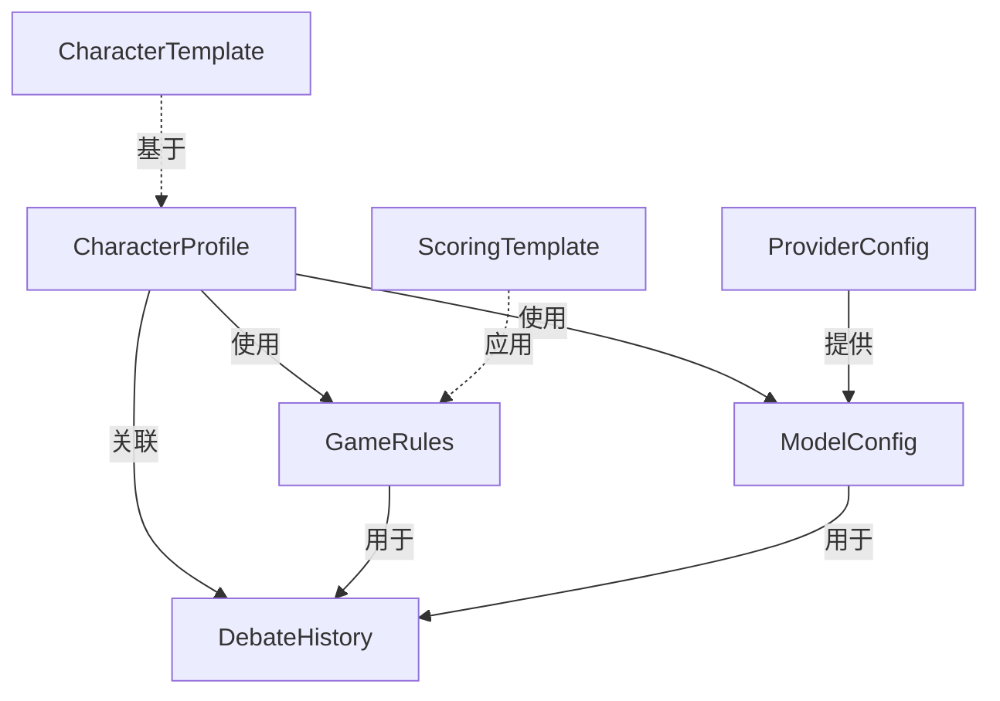

# 存储与配置系统设计文档

## 目录
- [数据结构设计](#数据结构设计)
- [数据关系](#数据关系)
- [存储方案](#存储方案)
- [实现路径](#实现路径)
- [技术细节](#技术细节)

## 数据结构设计

### 1. 角色配置 (CharacterProfile)

```typescript
interface CharacterProfile {
  // 基本信息
  id: string;                // 角色ID
  name: string;              // 角色名称
  avatar?: string;           // 头像URL
  description?: string;      // 角色描述
  
  // 人设配置
  persona: {
    personality: string[];   // 性格特征（可多选：严谨、幽默、激进等）
    speakingStyle: string;   // 说话风格（学术派、平民化、专业等）
    background: string;      // 专业背景（法律、经济、科技等）
    values: string[];        // 价值观（功利主义、人文主义等）
    argumentationStyle: string[]; // 论证风格（数据驱动、案例引用等）
    customDescription?: string;   // 自定义人设描述
  };
  
  // 模型关联
  modelConfig: {
    modelId: string;         // 关联的模型ID
    provider: string;        // 模型供应商
    parameters?: {           // 模型参数（可选）
      temperature?: number;  // 温度
      topP?: number;        // 采样阈值
      maxTokens?: number;   // 最大token数
      presencePenalty?: number;  // 存在惩罚
      frequencyPenalty?: number; // 频率惩罚
    };
  };
  
  // 调用配置
  callConfig: {
    type: 'dify' | 'direct';  // 调用模式
    dify?: {                  // Dify配置
      serverUrl: string;      // 服务器URL
      apiKey: string;         // API密钥
      workflowId: string;     // 工作流ID
      parameters: Record<string, any>; // 工作流参数
    };
    direct?: {                // 直接API配置
      provider: string;       // 供应商
      apiKey: string;        // API密钥
      model: string;         // 模型名称
      parameters: Record<string, any>; // API参数
    };
  };
  
  // 元数据
  createdAt: number;          // 创建时间
  updatedAt: number;          // 更新时间
  isTemplate?: boolean;       // 是否为模板
  templateId?: string;        // 使用的模板ID（如果基于模板创建）
}

// 预设模板
interface CharacterTemplate {
  id: string;                // 模板ID
  name: string;              // 模板名称
  description: string;       // 模板描述
  persona: CharacterProfile['persona']; // 人设配置
  modelConfig?: Partial<CharacterProfile['modelConfig']>; // 可选的模型配置
  createdAt: number;         // 创建时间
  updatedAt: number;         // 更新时间
}

// 配置选项
interface CharacterConfigOptions {
  personality: readonly string[];        // 性格特征选项
  speakingStyle: readonly string[];     // 说话风格选项
  background: readonly string[];        // 专业背景选项
  values: readonly string[];           // 价值观选项
  argumentationStyle: readonly string[]; // 论证风格选项
}
```

### 2. 游戏规则 (GameRules)

```typescript
// 主题配置
interface TopicConfig extends BaseEntity {
  title: string;          // 辩题
  background: string;     // 主题背景
}

// 规则配置
interface RuleConfig extends BaseEntity {
  format: 'structured' | 'free';  // 辩论形式：正反方/自由
  description: string;            // 规则说明
  advancedRules: {
    maxLength: number;            // 最大字数
    minLength: number;           // 最小字数
    allowQuoting: boolean;       // 允许引用
    requireResponse: boolean;    // 要求回应
    allowStanceChange: boolean;  // 允许立场转换
    requireEvidence: boolean;    // 要求证据支持
  }
}

// 配置模板
interface ConfigTemplate extends BaseEntity {
  name: string;
  topic: TopicConfig;
  rules: RuleConfig;
}

// 主题-规则关联
interface TopicRuleAssociation extends BaseEntity {
  topicId: string;
  ruleId: string;
  isDefault: boolean;        // 是否为该主题的默认规则
  typeValidation: {
    isTypeMatched: boolean;  // 类型是否匹配
    matchDetails: {
      topicType: 'policy' | 'value' | 'fact';
      ruleFormat: 'structured' | 'free';
    }
  }
}

// 评分规则
interface ScoringRules {
  dimensions: {
    logic: {              // 逻辑性
      weight: number;     // 权重 (0-100)
      criteria: string[]; // 评分标准
    };
    naturalness: {        // 人类自然度
      weight: number;     // 权重 (0-100)
      criteria: string[]; // 评分标准
    };
    compliance: {         // 规则遵守度
      weight: number;     // 权重 (0-100)
      criteria: string[]; // 评分标准
    };
    consistency: {        // 立场一致性
      weight: number;     // 权重 (0-100)
      criteria: string[]; // 评分标准
    };
    responsiveness: {     // 反应能力
      weight: number;     // 权重 (0-100)
      criteria: string[]; // 评分标准
    };
  };
  bonusPoints: {          // 额外加分项
    innovation: number;   // 创新性
    persuasiveness: number; // 说服力
    clarity: number;      // 表达清晰度
  };
}

// 评分标准模板
interface ScoringTemplate extends BaseEntity {
  name: string;
  description: string;
  dimensions: ScoringRules['dimensions'];
  bonusPoints: ScoringRules['bonusPoints'];
}
```

### 3. 模型配置 (ModelConfig)

```typescript
// 模型参数配置
interface ModelParameters {
  temperature: number;    // 温度 (0-2)
  topP: number;          // 采样阈值 (0-1)
  maxTokens: number;     // 最大token数
  // 可选参数
  presencePenalty?: number;   // 存在惩罚
  frequencyPenalty?: number;  // 频率惩罚
  stop?: string[];           // 停止词
  seed?: number;             // 随机种子
}

// 认证配置
interface AuthConfig {
  baseUrl: string;           // API基础URL
  apiKey?: string;          // API密钥
  organizationId?: string;  // 组织ID（部分供应商需要）
}

// 模型配置
interface ModelConfig {
  // 基本信息
  id: string;                // 配置ID
  name: string;              // 配置名称
  description?: string;      // 配置描述
  
  // 供应商和模型
  provider: string;          // 供应商ID (如: 'openai', 'anthropic')
  model: string;            // 模型名称
  
  // 参数配置
  parameters: ModelParameters;
  
  // 认证信息
  auth: AuthConfig;
  
  // 供应商特定配置
  providerSpecific?: {
    [key: string]: any;     // 供应商特定的参数
  };
  
  // 元数据
  createdAt: number;         // 创建时间
  updatedAt: number;         // 更新时间
  isDefault?: boolean;       // 是否为默认配置
  isEnabled: boolean;        // 是否启用
}

// 供应商配置
interface ProviderConfig {
  id: string;               // 供应商ID
  name: string;             // 供应商名称
  models: string[];         // 支持的模型列表
  defaultBaseUrl?: string;  // 默认API基础URL
  requiresOrganization?: boolean; // 是否需要组织ID
  isEnabled: boolean;       // 是否启用
}

// 参数范围配置
interface ParameterRange {
  min: number;
  max: number;
  step: number;
  default: number;
}

interface ParameterRanges {
  temperature: ParameterRange;
  topP: ParameterRange;
  maxTokens: ParameterRange;
}

// 默认参数范围
const DEFAULT_PARAMETER_RANGES: ParameterRanges = {
  temperature: {
    min: 0,
    max: 2,
    step: 0.1,
    default: 0.7,
  },
  topP: {
    min: 0,
    max: 1,
    step: 0.1,
    default: 0.9,
  },
  maxTokens: {
    min: 100,
    max: 4000,
    step: 100,
    default: 2000,
  },
};

// 预定义供应商列表
const DEFAULT_PROVIDERS: ProviderConfig[] = [
  {
    id: 'openai',
    name: 'OpenAI',
    models: ['gpt-4', 'gpt-4-turbo', 'gpt-3.5-turbo'],
    defaultBaseUrl: 'https://api.openai.com/v1',
    requiresOrganization: true,
    isEnabled: true,
  },
  {
    id: 'anthropic',
    name: 'Anthropic',
    models: ['claude-3-opus', 'claude-3-sonnet', 'claude-2.1'],
    defaultBaseUrl: 'https://api.anthropic.com/v1',
    isEnabled: true,
  },
  // ... 其他供应商配置
];

// 部分配置类型（用于更新）
type PartialModelConfig = {
  id?: string;
  name?: string;
  provider?: string;
  model?: string;
  parameters?: Partial<ModelParameters>;
  auth?: Partial<AuthConfig>;
  providerSpecific?: {
    [key: string]: any;
  };
};
```

### 4. 评分系统 (ScoringSystem)

```typescript
// 评分配置
interface ScoringConfig extends BaseEntity {
  // 基础信息
  name: string;
  description: string;
  
  // 评分规则
  scoringRule: string;
  
  // 维度配置
  dimensionScores: {
    logic: {
      weight: number;     // 权重（35）
      criteria: string[]; // 评分标准
    };
    humanness: {
      weight: number;     // 权重（30）
      criteria: string[]; // 评分标准
    };
    compliance: {
      weight: number;     // 权重（35）
      criteria: string[]; // 评分标准
    };
  };
  
  // 自定义评分规则
  customScoreRules: Array<{
    id: string;
    name: string;
    score: number;
    criteria: string[];
  }>;
}

// 评分结果存储
interface ScoringRecord extends BaseEntity {
  // 关联信息
  debateId: string;      // 辩论ID
  roundId: string;       // 轮次ID
  speakerId: string;     // 发言者ID
  judgeId: string;       // 评判ID
  
  // 评分详情
  dimensionScores: {
    logic: number;
    humanness: number;
    compliance: number;
  };
  
  // 自定义评分
  customScores: Array<{
    ruleId: string;
    score: number;
  }>;
  
  // 总分和反馈
  totalScore: number;
  feedback: string;
  
  // 元数据
  timestamp: number;
  version: number;
}

// 评分模板
interface ScoringTemplate extends BaseEntity {
  name: string;
  description: string;
  config: ScoringConfig;
  isDefault: boolean;
  category: string;
  tags: string[];
}

// 存储结构
interface ScoringStorage {
  // 配置存储
  configs: {
    [configId: string]: ScoringConfig;
  };
  
  // 结果存储
  records: {
    [recordId: string]: ScoringRecord;
  };
  
  // 模板存储
  templates: {
    [templateId: string]: ScoringTemplate;
  };
  
  // 索引
  indices: {
    byDebate: {
      [debateId: string]: string[]; // recordIds
    };
    byJudge: {
      [judgeId: string]: string[]; // recordIds
    };
    byTemplate: {
      [templateId: string]: string[]; // configIds
    };
  };
}

// 数据同步配置
interface SyncConfig {
  // 同步策略
  strategy: 'realtime' | 'batch' | 'manual';
  
  // 批量同步配置
  batchSync?: {
    interval: number;     // 同步间隔（毫秒）
    threshold: number;    // 触发同步的记录数阈值
  };
  
  // 冲突解决策略
  conflictResolution: 'server' | 'client' | 'manual';
  
  // 版本控制
  versionControl: {
    enabled: boolean;
    maxVersions: number;
  };
}
```

### 角色配置存储更新
```typescript
interface CharacterStorage {
  // 角色状态存储
  characterState: {
    selectedCharacters: {
      [playerId: string]: string;  // playerId -> characterId
    };
    takenOverCharacters: {
      [characterId: string]: {
        playerId: string;
        playerName: string;
        timestamp: number;
      };
    };
  };

  // 角色选择配置
  selectionConfig: {
    maxPlayersPerRole: number;
    allowCharacterSwitch: boolean;
    allowCancelSelection: boolean;
  };

  // 角色显示配置
  displayConfig: {
    showAvatar: boolean;
    showDescription: boolean;
    showModelInfo: boolean;
  };
}

// 角色选择验证
const characterSelectionSchema = z.object({
  selectedCharacters: z.record(z.string(), z.string()),
  takenOverCharacters: z.record(z.string(), z.object({
    playerId: z.string(),
    playerName: z.string(),
    timestamp: z.number()
  })),
  maxPlayersPerRole: z.number().min(1).max(10),
  allowCharacterSwitch: z.boolean(),
  allowCancelSelection: z.boolean()
});
```

### AI裁判系统存储更新
```typescript
interface JudgeStorage {
  // 评分配置存储
  scoringConfig: {
    dimensions: {
      logic: {
        weight: number;
        criteria: string[];
        levels: Array<{
          score: [number, number];
          description: string;
        }>;
      };
      expression: {
        weight: number;
        criteria: string[];
      };
      compliance: {
        weight: number;
        criteria: string[];
      };
    };
    bonusPoints: {
      innovation: number;
      persuasiveness: number;
      clarity: number;
    };
  };

  // 评分记录存储
  scoringRecords: {
    [recordId: string]: {
      debateId: string;
      roundId: string;
      speakerId: string;
      dimensionScores: {
        logic: number;
        expression: number;
        compliance: number;
      };
      bonusScore: number;
      totalScore: number;
      evaluation: string;
      timestamp: number;
    };
  };

  // 轮次统计存储
  roundStats: {
    [roundId: string]: {
      averageScore: number;
      highestScore: number;
      lowestScore: number;
      participantScores: {
        [speakerId: string]: number;
      };
    };
  };
}

// 评分记录验证
const scoringRecordSchema = z.object({
  debateId: z.string(),
  roundId: z.string(),
  speakerId: z.string(),
  dimensionScores: z.object({
    logic: z.number().min(0).max(30),
    expression: z.number().min(0).max(25),
    compliance: z.number().min(0).max(20)
  }),
  bonusScore: z.number().min(0).max(10),
  totalScore: z.number().min(0).max(100),
  evaluation: z.string().max(500),
  timestamp: z.number()
});
```

## 数据关系



关系说明:
1. 角色配置 (CharacterProfile)
   - 可以基于模板 (CharacterTemplate) 创建
   - 使用一个游戏规则配置 (GameRules)
   - 关联一个模型配置 (ModelConfig)
   - 可以参与多个对局 (DebateHistory)

2. 游戏规则 (GameRules)
   - 可以应用评分模板 (ScoringTemplate)
   - 用于管理多个对局
   - 只能有一个默认配置

3. 模型配置 (ModelConfig)
   - 由供应商配置 (ProviderConfig) 提供支持
   - 可以被多个角色使用
   - 只能有一个默认配置

## 存储方案

### LocalStorage
用于存储:
- 用户偏好设置
- 当前选中的配置ID
- 界面状态
- API密钥（可选，加密存储）

存储键设计:
```typescript
const storageKeys = {
  // 当前选中配置
  currentCharacterId: 'current_character_id',
  currentRulesetId: 'current_ruleset_id',
  currentModelConfigId: 'current_model_config_id',
  
  // 用户偏好
  userPreferences: {
    theme: 'user_preferences_theme',
    language: 'user_preferences_language',
    autoBackup: 'user_preferences_auto_backup',
  },
  
  // 界面状态
  uiState: {
    sidebarCollapsed: 'ui_state_sidebar_collapsed',
    lastViewedPage: 'ui_state_last_viewed_page',
    tableSettings: 'ui_state_table_settings',
  },
  
  // API密钥（加密存储）
  apiKeys: 'encrypted_api_keys',
};
```

### IndexedDB
数据库名: `ai_debate_storage`
版本: 1

存储表设计:
1. 角色配置表 (character_profiles)
   - 主键: id
   - 索引: 
     * name (unique)
     * createdAt
     * templateId
     * modelConfigId

2. 角色模板表 (character_templates)
   - 主键: id
   - 索引:
     * name (unique)
     * createdAt

3. 游戏规则表 (game_rules)
   - 主键: id
   - 索引:
     * name (unique)
     * isDefault
     * version

4. 评分模板表 (scoring_templates)
   - 主键: id
   - 索引:
     * name (unique)
     * createdAt

5. 模型配置表 (model_configs)
   - 主键: id
   - 索引:
     * name (unique)
     * provider
     * isDefault
     * isEnabled

6. 供应商配置表 (provider_configs)
   - 主键: id
   - 索引:
     * name (unique)
     * isEnabled

7. 对局历史表 (debate_history)
   - 主键: id
   - 索引:
     * characterId
     * rulesetId
     * createdAt

## 实现路径

### Phase 1: 基础设施 (Week 1)
- 创建数据模型和类型定义
- 设置 IndexedDB 数据库结构
- 实现基础 CRUD 服务
- 添加数据验证层

### Phase 2: 核心功能 (Week 2)
- 实现配置编辑器组件
- 添加数据同步机制
- 实现默认配置管理
- 添加配置导入导出功能

### Phase 3: 集成 (Week 3)
- 整合备份管理功能
- 实现配置迁移工具
- 添加批量操作支持
- 实现配置模板功能

### Phase 4: 优化 (Week 4)
- 性能优化
- 用户体验改进
- 错误处理完善
- 添加数据分析功能

## 技术细节

### 数据验证
使用 Zod 进行运行时类型验证:

```typescript
import { z } from 'zod';

// 角色配置验证
const CharacterProfileSchema = z.object({
  id: z.string().uuid(),
  name: z.string().min(1).max(50),
  persona: z.object({
    personality: z.array(z.string()),
    speakingStyle: z.string(),
    background: z.string(),
    values: z.array(z.string()),
    argumentationStyle: z.array(z.string()),
    customDescription: z.string().optional(),
  }),
  // ... 其他字段验证
});

// 模型配置验证
const ModelConfigSchema = z.object({
  id: z.string().uuid(),
  name: z.string().min(1).max(50),
  provider: z.string(),
  model: z.string(),
  parameters: z.object({
    temperature: z.number().min(0).max(2),
    topP: z.number().min(0).max(1),
    maxTokens: z.number().min(100).max(4000),
    // ... 其他参数验证
  }),
  // ... 其他字段验证
});
```

### 错误处理
统一的错误类型:

```typescript
enum StorageErrorCode {
  VALIDATION_ERROR = 'VALIDATION_ERROR',
  DUPLICATE_ERROR = 'DUPLICATE_ERROR',
  NOT_FOUND_ERROR = 'NOT_FOUND_ERROR',
  STORAGE_ERROR = 'STORAGE_ERROR',
  AUTH_ERROR = 'AUTH_ERROR',
  ENCRYPTION_ERROR = 'ENCRYPTION_ERROR',
  MIGRATION_ERROR = 'MIGRATION_ERROR',
}

class StorageError extends Error {
  constructor(
    message: string,
    public code: StorageErrorCode,
    public field?: string,
    public cause?: Error
  ) {
    super(message);
  }
}
```

### 状态管理
使用 Pinia 进行状态管理:

```typescript
// 角色配置状态
export const useCharacterStore = defineStore('character', {
  state: () => ({
    currentProfile: null as CharacterProfile | null,
    templates: [] as CharacterTemplate[],
    isLoading: false,
    error: null as StorageError | null,
  }),
  actions: {
    async loadProfile(id: string) {/* ... */},
    async saveProfile(profile: CharacterProfile) {/* ... */},
    async createFromTemplate(templateId: string) {/* ... */},
  },
});

// 模型配置状态
export const useModelStore = defineStore('model', {
  state: () => ({
    currentConfig: null as ModelConfig | null,
    providers: [] as ProviderConfig[],
    isLoading: false,
    error: null as StorageError | null,
  }),
  actions: {
    async loadConfig(id: string) {/* ... */},
    async saveConfig(config: ModelConfig) {/* ... */},
    async validateApiKey(provider: string, apiKey: string) {/* ... */},
  },
});
```

### 数据加密
API密钥等敏感数据的加密处理:

```typescript
class EncryptionService {
  private readonly algorithm = 'AES-GCM';
  private readonly keyLength = 256;

  async encrypt(data: string): Promise<string> {/* ... */}
  async decrypt(encryptedData: string): Promise<string> {/* ... */}
  private async generateKey(): Promise<CryptoKey> {/* ... */}
}
```

### 数据迁移
版本升级时的迁移策略:

```typescript
interface Migration {
  version: number;
  up: (db: IDBDatabase) => Promise<void>;
  down: (db: IDBDatabase) => Promise<void>;
}

const migrations: Migration[] = [
  {
    version: 1,
    up: async (db) => {
      // 初始化数据库结构
      db.createObjectStore('character_profiles', { keyPath: 'id' });
      // ... 其他表创建
    },
    down: async (db) => {
      // 回滚操作
      db.deleteObjectStore('character_profiles');
      // ... 其他表删除
    },
  },
  // ... 其他版本迁移
];
```

### 性能优化
1. 索引优化
```typescript
// 创建复合索引
characterStore.createIndex('model_enabled', ['modelConfigId', 'isEnabled']);
characterStore.createIndex('template_created', ['templateId', 'createdAt']);
```

2. 缓存策略
```typescript
class CacheService {
  private cache = new Map<string, {
    data: any;
    timestamp: number;
    ttl: number;
  }>();

  async get(key: string): Promise<any> {/* ... */}
  async set(key: string, value: any, ttl: number): Promise<void> {/* ... */}
  async invalidate(pattern: string): Promise<void> {/* ... */}
}
```

3. 批量操作优化
```typescript
class BatchOperationService {
  private batchSize = 100;
  private queue: Operation[] = [];

  async addOperation(operation: Operation): Promise<void> {/* ... */}
  async processBatch(): Promise<void> {/* ... */}
  private async executeBatch(operations: Operation[]): Promise<void> {/* ... */}
}
```

## 已实现功能

### 1. 存储管理系统
- 实现了基于 LocalStorage 和 IndexedDB 的混合存储系统
- 添加了数据验证层，使用 Zod 进行类型验证
- 实现了数据备份和恢复功能
- 添加了版本控制和数据迁移支持
- 实现了错误处理和日志记录系统

### 2. 模型配置管理
- 支持多种模型供应商（OpenAI、Anthropic、Deepseek等）
- 实现了模型配置的CRUD操作
- 支持配置导入导出功能
- 添加了模型连接测试功能
- 实现了配置的本地持久化存储

### 3. AI角色配置管理
- 实现了角色基本信息的配置功能
- 支持本地上传和URL两种头像配置方式
- 实现了完整的人设配置系统
- 添加了角色模板管理功能
- 支持配置的本地持久化存储

### 4. 裁判系统配置
- 实现了裁判系统的配置功能
- 支持AI裁判和群体评审的配置
- 实现了评分标准的配置
- 添加了评分记录和评分统计功能

## 技术实现细节

### 1. 存储层设计
```typescript
// 基础存储服务接口
interface StorageService {
  get<T>(key: string): Promise<T | null>;
  set<T>(key: string, value: T): Promise<void>;
  remove(key: string): Promise<void>;
  clear(): Promise<void>;
}

// 数据验证装饰器
@withValidation()
class BaseStorageService<T> {
  protected schema: z.ZodType<T>;
  // ...
}
```

### 2. 数据验证
- 使用 Zod 进行运行时类型验证
- 实现了验证装饰器用于自动校验
- 添加了自定义验证规则支持

### 3. 状态管理
- 使用 React Context 进行状态管理
- 实现了数据的自动持久化
- 添加了状态变更日志记录

## 待优化项目

### 1. 性能优化
- [ ] 添加数据缓存层
- [ ] 优化大量数据的读写性能
- [ ] 实现增量更新机制

### 2. 数据同步
- [ ] 添加在线同步功能
- [ ] 实现冲突解决机制
- [ ] 添加实时协作支持

### 3. 安全性
- [ ] 添加数据加密功能
- [ ] 实现敏感信息保护
- [ ] 添加访问控制机制

## 未来规划

### 1. 多端同步
- 实现基于 WebSocket 的实时同步
- 添加离线支持
- 实现数据冲突解决

### 2. 数据分析
- 添加使用数据统计
- 实现性能监控
- 添加错误追踪

### 3. 扩展性
- 支持插件系统
- 添加自定义存储适配器
- 实现多语言支持

## 注意事项

1. 数据一致性
- 确保所有存储操作都经过验证
- 保持数据模型的版本兼容性
- 正确处理并发操作

2. 错误处理
- 实现完整的错误追踪
- 添加用户友好的错误提示
- 保证数据操作的原子性

3. 性能考虑
- 控制单次存储数据量
- 实现数据分页加载
- 优化频繁操作的性能

## 技术栈选择

1. 核心技术
- TypeScript: 类型安全
- React: UI框架
- Zod: 数据验证
- IndexedDB: 本地存储

2. 工具库
- uuid: 生成唯一ID
- antd: UI组件库
- emotion: CSS-in-JS方案

3. 开发工具
- ESLint: 代码规范
- Prettier: 代码格式化
- Jest: 单元测试 