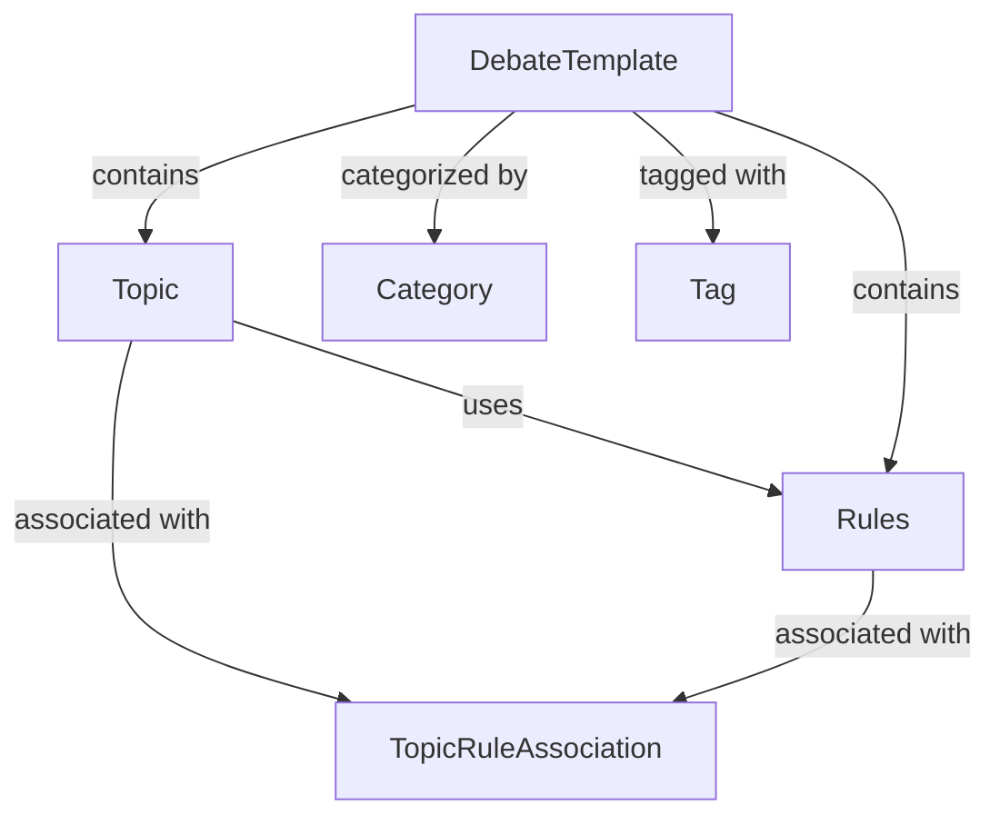

# 主题与规则设计文档

## 目录
- [系统概述](#系统概述)
- [数据结构设计](#数据结构设计)
- [数据关系设计](#数据关系设计)
- [存储方案](#存储方案)
- [接口设计](#接口设计)
- [UI设计](#UI设计)
- [实现路径](#实现路径)

## 系统概述

主题与规则管理系统是AI辩论系统的核心配置模块之一，负责管理辩论主题、规则配置、模板管理等功能。该系统与角色管理系统紧密集成，共同构成完整的游戏配置界面。

### 核心功能
1. 主题管理
   - 主题创建与编辑
   - 主题模板管理
   - 主题分类与标签
   - 主题导入导出

2. 规则管理
   - 规则创建与编辑
   - 规则模板管理
   - 规则验证
   - 规则导入导出

3. 主题-规则关联
   - 关联管理
   - 兼容性评估
   - 默认规则配置

## 数据结构设计

### 1. 主题管理
```typescript
interface Topic {
  // 基础信息
  id: string;                // 主题ID
  title: string;            // 辩题
  description: string;      // 主题描述
  background?: string;      // 背景资料
  type: 'binary' | 'multi'; // 辩论类型：二元对立/多方观点
  
  // 元数据
  createdAt: number;        // 创建时间
  updatedAt: number;        // 更新时间
  createdBy?: string;       // 创建者
  isTemplate: boolean;      // 是否为模板
  templateId?: string;      // 基于哪个模板创建（如果有）
  
  // 使用统计
  usageCount: number;       // 使用次数
  lastUsed?: number;        // 最后使用时间
  
  // 标签系统
  tags: string[];           // 主题标签（如：经济、科技、伦理等）
  
  // 版本控制
  version: number;          // 版本号
  isLatest: boolean;        // 是否为最新版本
  previousVersions?: string[]; // 历史版本ID
}

### 2. 规则管理
```typescript
interface Rules {
  // 基础信息
  id: string;                // 规则ID
  name: string;              // 规则集名称
  description?: string;      // 规则说明
  
  // 基础规则
  format: 'binary' | 'multi';  // 辩论形式（与主题类型对应）
  speechRules: {
    maxLength: number;       // 最大字数
    minLength: number;       // 最小字数
    allowEmpty: boolean;     // 允许空发言
    allowRepeat: boolean;    // 允许重复发言
    timeLimit?: number;      // 时间限制（秒）
  };
  
  // 高级规则
  advancedRules: {
    allowQuoting: boolean;   // 允许引用
    requireResponse: boolean; // 必须回应前一个观点
    allowStanceChange: boolean; // 允许改变立场
    requireEvidence: boolean;   // 要求提供论据
    argumentTypes: string[];    // 允许的论证类型
  };
  
  // 元数据
  createdAt: number;
  updatedAt: number;
  createdBy?: string;
  isTemplate: boolean;
  templateId?: string;
  
  // 使用统计
  usageCount: number;
  lastUsed?: number;
  
  // 版本控制
  version: number;
  isLatest: boolean;
  previousVersions?: string[];
}

### 3. 主题-规则关联
```typescript
interface TopicRuleAssociation {
  id: string;
  topicId: string;
  ruleId: string;
  isDefault: boolean;        // 是否为该主题的默认规则
  compatibility: number;     // 兼容性评分（0-100）
  createdAt: number;
  updatedAt: number;
  
  // 新增：类型匹配验证
  typeValidation: {
    isTypeMatched: boolean;  // 类型是否匹配
    matchType: 'binary' | 'multi'; // 匹配的类型
  };
}

### 4. 模板管理
```typescript
interface DebateTemplate {
  // 基础信息
  id: string;
  name: string;
  description?: string;
  
  // 模板内容（包含主题和规则）
  content: {
    topic: Topic;         // 主题配置
    rules: Rules;         // 规则配置
  };
  
  // 元数据
  createdAt: number;
  updatedAt: number;
  createdBy?: string;
  
  // 使用统计
  usageCount: number;
  lastUsed?: number;
  
  // 分类信息
  category: string;
  tags: string[];
  
  // 预设标记
  isPreset: boolean;     // 是否为系统预设模板
  isEditable: boolean;   // 是否可编辑（预设模板不可编辑）
}

### 5. 导入导出配置
```typescript
interface ExportConfig {
  // 导出内容选择
  templates: {
    all?: boolean;          // 是否导出所有模板
    ids?: string[];         // 指定导出的模板ID列表
    includePreset?: boolean; // 是否包含预设模板
  };
  
  // 导出格式
  format: 'json' | 'yaml';
  
  // 元数据
  timestamp: number;
  version: string;
  
  // 数据过滤
  filter?: {
    categories?: string[];  // 按分类筛选
    tags?: string[];       // 按标签筛选
    dateRange?: {
      start: number;
      end: number;
    };
  };
}

// 导出结果
interface ExportResult {
  metadata: {
    version: string;
    timestamp: number;
    exportedBy?: string;
    totalCount: number;
  };
  
  templates: DebateTemplate[];
  
  // 关联数据
  categories: Category[];
  tags: Tag[];
}

// 导入配置
interface ImportConfig {
  // 导入行为
  behavior: {
    onDuplicate: 'skip' | 'replace' | 'rename';  // 重复模板处理方式
    preserveMetadata: boolean;                   // 是否保留原始元数据
    importCategories: boolean;                   // 是否导入分类
    importTags: boolean;                         // 是否导入标签
  };
  
  // 数据验证
  validation: {
    validateTypeMatch: boolean;     // 是否验证类型匹配
    validateCompleteness: boolean;  // 是否验证完整性
    strict: boolean;               // 是否严格模式（出错即停止）
  };
}

// 导入结果
interface ImportResult {
  success: boolean;
  summary: {
    total: number;
    imported: number;
    skipped: number;
    failed: number;
  };
  details: {
    imported: string[];    // 成功导入的模板ID
    skipped: string[];     // 跳过的模板ID
    failed: {             // 导入失败的记录
      templateId: string;
      reason: string;
      errors: string[];
    }[];
  };
  // 新创建的关联数据
  created: {
    categories: string[];  // 新创建的分类ID
    tags: string[];       // 新创建的标签ID
  };
}

// 导入导出操作接口
interface ImportExportOperations {
  // 导出操作
  export: {
    // 导出模板
    exportTemplates: (config: ExportConfig) => Promise<Blob>;
    
    // 获取导出预览
    getExportPreview: (config: ExportConfig) => Promise<{
      count: number;
      size: number;
      templates: Array<{
        id: string;
        name: string;
      }>;
    }>;
  };
  
  // 导入操作
  import: {
    // 验证导入文件
    validateImportFile: (file: Blob) => Promise<{
      isValid: boolean;
      version: string;
      count: number;
      categories: string[];
      tags: string[];
      errors: string[];
    }>;
    
    // 导入模板
    importTemplates: (file: Blob, config: ImportConfig) => Promise<ImportResult>;
    
    // 获取导入预览
    getImportPreview: (file: Blob) => Promise<{
      templates: Array<{
        name: string;
        exists: boolean;
      }>;
      categories: string[];
      tags: string[];
    }>;
  };
}
```

## 数据关系设计

主题与规则之间的关系图：



## 存储方案

### 1. 存储方案概述
```typescript
// 存储策略
interface StorageStrategy {
  // LocalStorage存储
  localStorage: {
    // 当前选中配置
    currentConfig: {
      selectedTemplateId?: string;
      selectedTopicId?: string;
      selectedRuleId?: string;
    };
    
    // 用户偏好
    preferences: {
      defaultType: 'binary' | 'multi';
      defaultCategory?: string;
      autoSave: boolean;
      theme: 'light' | 'dark';
    };
    
    // 界面状态
    uiState: {
      lastViewedCategory?: string;
      expandedSections: string[];
      listViewMode: 'grid' | 'list';
    };
  };
  
  // IndexedDB存储
  indexedDB: {
    // 数据库配置
    dbName: 'AIDebateTemplates';
    version: 1;
    
    // 存储对象
    stores: {
      templates: {
        keyPath: 'id',
        indexes: {
          name: { unique: true },
          category: { unique: false },
          tags: { multiEntry: true },
          type: { unique: false },
          createdAt: { unique: false }
        }
      };
      categories: {
        keyPath: 'id',
        indexes: {
          name: { unique: true },
          order: { unique: false }
        }
      };
      tags: {
        keyPath: 'id',
        indexes: {
          name: { unique: true },
          usage: { unique: false }
        }
      };
    };
  };
}

// LocalStorage键定义
const STORAGE_KEYS = {
  currentConfig: 'debate_current_config',
  preferences: 'debate_preferences',
  uiState: 'debate_ui_state'
} as const;

// 缓存策略
interface CacheStrategy {
  // 内存缓存
  memoryCache: {
    templates: {
      maxSize: 100;           // 最大缓存条目数
      ttl: 5 * 60 * 1000;    // 缓存时间（5分钟）
    };
    categories: {
      maxSize: 20;
      ttl: 30 * 60 * 1000;   // 缓存时间（30分钟）
    };
    tags: {
      maxSize: 50;
      ttl: 30 * 60 * 1000;   // 缓存时间（30分钟）
    };
  };
}
```

### 2. 数据操作接口
```typescript
interface StorageOperations {
  // LocalStorage操作
  local: {
    // 获取当前配置
    getCurrentConfig: () => Promise<StorageStrategy['localStorage']['currentConfig']>;
    // 更新当前配置
    updateCurrentConfig: (config: Partial<StorageStrategy['localStorage']['currentConfig']>) => Promise<void>;
    // 获取用户偏好
    getPreferences: () => Promise<StorageStrategy['localStorage']['preferences']>;
    // 更新用户偏好
    updatePreferences: (prefs: Partial<StorageStrategy['localStorage']['preferences']>) => Promise<void>;
    // 获取界面状态
    getUIState: () => Promise<StorageStrategy['localStorage']['uiState']>;
    // 更新界面状态
    updateUIState: (state: Partial<StorageStrategy['localStorage']['uiState']>) => Promise<void>;
  };
  
  // IndexedDB操作
  indexed: {
    // 模板操作
    templates: {
      add: (template: DebateTemplate) => Promise<string>;
      update: (id: string, template: Partial<DebateTemplate>) => Promise<void>;
      delete: (id: string) => Promise<void>;
      get: (id: string) => Promise<DebateTemplate>;
      list: (filter?: TemplateFilter) => Promise<DebateTemplate[]>;
    };
    
    // 分类操作
    categories: {
      add: (category: Category) => Promise<string>;
      update: (id: string, category: Partial<Category>) => Promise<void>;
      delete: (id: string) => Promise<void>;
      list: () => Promise<Category[]>;
      reorder: (orderedIds: string[]) => Promise<void>;
    };
    
    // 标签操作
    tags: {
      add: (tag: Tag) => Promise<string>;
      update: (id: string, tag: Partial<Tag>) => Promise<void>;
      delete: (id: string) => Promise<void>;
      list: () => Promise<Tag[]>;
      merge: (sourceId: string, targetId: string) => Promise<void>;
    };
  };
}

### 3. 错误处理
```typescript
// 存储错误类型
enum StorageErrorType {
  // LocalStorage错误
  LOCAL_STORAGE_FULL = 'LOCAL_STORAGE_FULL',
  LOCAL_STORAGE_QUOTA_EXCEEDED = 'LOCAL_STORAGE_QUOTA_EXCEEDED',
  LOCAL_STORAGE_INVALID_DATA = 'LOCAL_STORAGE_INVALID_DATA',
  
  // IndexedDB错误
  INDEXED_DB_NOT_SUPPORTED = 'INDEXED_DB_NOT_SUPPORTED',
  INDEXED_DB_VERSION_ERROR = 'INDEXED_DB_VERSION_ERROR',
  INDEXED_DB_UPGRADE_NEEDED = 'INDEXED_DB_UPGRADE_NEEDED',
  INDEXED_DB_QUOTA_EXCEEDED = 'INDEXED_DB_QUOTA_EXCEEDED',
  
  // 通用错误
  INVALID_DATA = 'INVALID_DATA',
  NOT_FOUND = 'NOT_FOUND',
  ALREADY_EXISTS = 'ALREADY_EXISTS',
  OPERATION_FAILED = 'OPERATION_FAILED'
}

// 存储错误处理
interface StorageError extends Error {
  type: StorageErrorType;
  details?: any;
}

// 错误处理策略
interface ErrorHandlingStrategy {
  // 重试策略
  retry: {
    maxAttempts: number;
    backoffMs: number;
    maxBackoffMs: number;
  };
  
  // 降级策略
  fallback: {
    useLocalStorage: boolean;    // 是否降级到LocalStorage
    useCacheOnly: boolean;       // 是否仅使用缓存
    offlineSupport: boolean;     // 是否支持离线模式
  };
  
  // 错误恢复
  recovery: {
    autoBackup: boolean;         // 是否自动备份
    backupInterval: number;      // 备份间隔
    validateBeforeWrite: boolean; // 写入前验证
  };
}
```

### 4. 数据迁移
```typescript
interface MigrationStrategy {
  // 版本升级
  upgrade: {
    validateData: boolean;      // 是否验证数据
    backupBeforeMigrate: boolean; // 是否备份
    rollbackOnError: boolean;   // 错误时是否回滚
  };
  
  // 数据转换
  transform: {
    preserveMetadata: boolean;  // 是否保留元数据
    validateAfterTransform: boolean; // 转换后验证
  };
}
```

### 5. 存储管理器
```typescript
interface StorageManager {
  // 初始化
  init: () => Promise<void>;
  
  // 状态检查
  checkStatus: () => Promise<{
    isAvailable: boolean;
    localStorage: {
      available: boolean;
      used: number;
      total: number;
    };
    indexedDB: {
      available: boolean;
      version: number;
    };
  }>;
  
  // 数据清理
  cleanup: {
    clearCache: () => Promise<void>;
    clearLocalStorage: () => Promise<void>;
    clearIndexedDB: () => Promise<void>;
    clearAll: () => Promise<void>;
  };
  
  // 存储监控
  monitor: {
    onQuotaExceeded: (handler: () => void) => void;
    onError: (handler: (error: StorageError) => void) => void;
    onStateChange: (handler: (state: any) => void) => void;
  };
}
```

## UI设计

### 整体布局
```
+--------------------------------------------------+
|  游戏配置                                         |
|--------------------------------------------------|
|  [角色分配] | [AI角色配置] | [模型管理]           |
|--------------------------------------------------|
|  // 配置区域（三栏布局）
|  +----------------------------------------------+
|  |   主题配置    |    规则配置    |   裁判配置   |
|  |---------------|----------------|--------------|
|  | [预设主题 ▼]  | [预设规则 ▼]   | [选择裁判 ▼] |
|  | 辩题: [     ] | 辩论形式:      | 评分维度:    |
|  | 描述: [     ] | ( )结构化      | 逻辑性: [30] |
|  | 背景: [     ] | ( )自由        | 表达: [25]   |
|  |               |                | 规则: [20]   |
|  |               | 发言规则:      | 效果: [25]   |
|  |               | 最大字数:[   ] |              |
|  |               | 最小字数:[   ] | 加分项配置:  |
|  |               |                | [✓]创新性    |
|  |               | [ ]允许空发言  | [✓]回应能力  |
|  |               | [ ]允许重复    | [✓]全面性    |
|  +----------------------------------------------+
|
|  [保存配置] [开始辩论]
+--------------------------------------------------+
```

### 响应式布局更新
```typescript
interface ResponsiveLayout {
  container: {
    display: 'flex',
    flexDirection: 'column',
    gap: 'var(--spacing-md)',
    height: '100%'
  },
  
  configContainer: {
    display: 'flex',
    justifyContent: 'space-between',
    gap: 'var(--spacing-md)',
    margin: 'var(--spacing-md) 0'
  },
  
  configSection: {
    flex: '1 1 33.33%',  // 三等分布局
    minWidth: '300px',   // 最小宽度
    padding: 'var(--spacing-md)',
    backgroundColor: 'var(--bg-color-secondary)',
    borderRadius: 'var(--border-radius-md)',
    boxShadow: 'var(--shadow-sm)'
  }
}

// 新增：裁判配置组件样式
interface JudgeConfigStyles {
  container: {
    display: 'flex',
    flexDirection: 'column',
    gap: 'var(--spacing-sm)'
  },
  
  header: {
    display: 'flex',
    justifyContent: 'space-between',
    alignItems: 'center',
    marginBottom: 'var(--spacing-md)'
  },
  
  judgeSelect: {
    width: '100%',
    marginBottom: 'var(--spacing-md)'
  },
  
  dimensionConfig: {
    marginBottom: 'var(--spacing-md)'
  },
  
  dimensionItem: {
    display: 'flex',
    justifyContent: 'space-between',
    alignItems: 'center',
    marginBottom: 'var(--spacing-sm)'
  },
  
  bonusConfig: {
    marginTop: 'var(--spacing-md)'
  },
  
  bonusItem: {
    display: 'flex',
    alignItems: 'center',
    gap: 'var(--spacing-sm)',
    marginBottom: 'var(--spacing-sm)'
  }
}
```

### 折叠面板设计
```typescript
interface CollapsiblePanel {
  header: {
    display: 'flex',
    justifyContent: 'space-between',
    alignItems: 'center',
    padding: 'var(--spacing-sm) var(--spacing-md)',
    cursor: 'pointer'
  },
  
  content: {
    padding: 'var(--spacing-md)',
    transition: 'height 0.3s ease'
  }
}
```

### 新增：类型匹配提示组件
```typescript
interface UIComponents {
  // ... existing components ...
  
  // 新增：类型匹配提示组件
  typeMatchIndicator: {
    styles: {
      matched: {
        color: 'var(--color-success)',
        icon: 'check-circle'
      },
      mismatched: {
        color: 'var(--color-error)',
        icon: 'warning-circle'
      }
    },
    messages: {
      matched: '主题类型与规则形式匹配',
      mismatched: '主题类型与规则形式不匹配，请选择对应类型的规则'
    }
  }
}
```

### 模板管理组件
```typescript
interface UIComponents {
  // ... existing components ...
  
  // 模板管理组件
  templateManager: {
    // 模板列表
    list: {
      layout: 'grid' | 'list';
      itemsPerPage: number;
      sortOptions: ('name' | 'createdAt' | 'usageCount')[];
      filterOptions: {
        categories: string[];
        tags: string[];
        isPreset: boolean;
      };
    };
    
    // 模板应用预览
    preview: {
      sections: {
        topic: {
          title: string;
          fields: (keyof Topic)[];
        };
        rules: {
          title: string;
          fields: (keyof Rules)[];
        };
      };
      actions: {
        apply: string;
        edit: string;
        cancel: string;
      };
    };
  };
}
```

## 实现路径

### 第一阶段：主题配置基础功能

1. **主题基本信息管理**
   - 主题标题（辩题）输入
   - 主题描述编辑
   - 背景资料（纯文本）编辑
   - 主题类型选择（正反双方/多方观点）

2. **模板功能**
   - 预设模板列表展示
   - 模板预览和应用
   - 基于当前配置保存为新模板
   - 模板管理（编辑/删除）
   - 模板分类和标签管理

3. **导入导出功能**
   - JSON格式导出
   - 导入验证
   - 批量导入支持
   - 导出历史记录

### 第二阶段：规则配置功能

1. **基础规则设置**
   - 辩论形式选择
   - 论点要求配置
   - 论证方式设置
   - 特殊限制添加

2. **规则模板功能**
   - 预设规则模板
   - 规则模板应用
   - 自定义规则保存

3. **规则验证系统**
   - 规则冲突检查
   - 规则有效性验证
   - 错误提示

### 第三阶段：集成与优化

1. **与现有系统集成**
   - 角色管理系统集成
   - 模型配置系统集成
   - 数据同步机制

2. **性能优化**
   - 数据缓存策略
   - 查询优化
   - 批量操作优化

3. **用户体验优化**
   - 响应式布局优化
   - 交互体验优化
   - 错误处理完善

## 新建 DebateConfigService.ts
export class DebateConfigService extends BaseStorageService {
  // 主题模板存储
  templates: {
    add: (template: DebateTemplate) => Promise<string>;
    update: (id: string, template: Partial<DebateTemplate>) => Promise<void>;
    delete: (id: string) => Promise<void>;
    get: (id: string) => Promise<DebateTemplate>;
    list: (filter?: TemplateFilter) => Promise<DebateTemplate[]>;
  };
  
  // 分类管理
  categories: {
    add: (category: Category) => Promise<string>;
    update: (id: string, category: Partial<Category>) => Promise<void>;
    delete: (id: string) => Promise<void>;
    list: () => Promise<Category[]>;
    reorder: (orderedIds: string[]) => Promise<void>;
  };
  
  // 标签管理
  tags: {
    add: (tag: Tag) => Promise<string>;
    update: (id: string, tag: Partial<Tag>) => Promise<void>;
    delete: (id: string) => Promise<void>;
    list: () => Promise<Tag[]>;
    merge: (sourceId: string, targetId: string) => Promise<void>;
  };
}

## 数据结构

### 主题配置 (TopicConfig)
```typescript
interface TopicConfig {
  title: string;          // 辩题
  background: string;     // 主题背景
}
```

### 规则配置 (RuleConfig)
```typescript
interface RuleConfig {
  format: 'structured' | 'free';  // 辩论形式：正反方/自由
  description: string;            // 规则说明
  advancedRules: {
    maxLength: number;            // 最大字数
    minLength: number;           // 最小字数
    allowQuoting: boolean;       // 允许引用
    requireResponse: boolean;    // 要求回应
    allowStanceChange: boolean;  // 允许立场转换
    requireEvidence: boolean;    // 要求证据支持
  }
}
```

### 配置模板 (ConfigTemplate)
```typescript
interface ConfigTemplate {
  id: string;
  name: string;
  topic: TopicConfig;
  rules: RuleConfig;
}
```

## UI 组件结构

### TopicRuleConfig
- 模板选择区域
  - 模板下拉选择
  - 加载/保存模板按钮
- 主题配置区域
  - 辩题输入
  - 主题背景输入
  - 重置/保存按钮
- 规则配置区域
  - 辩论形式选择（单选）
  - 规则说明输入
  - 高级规则设置（可折叠）
    - 字数限制
    - 其他规则选项
  - 重置/保存按钮

## 状态管理

### useDebateConfig Hook
```typescript
interface UseDebateConfigReturn {
  topic: TopicConfig;
  rules: RuleConfig;
  errors: ValidationError[];
  selectedTemplate: string;
  templates: ConfigTemplate[];
  updateTopic: (updates: Partial<TopicConfig>) => void;
  updateRules: (updates: Partial<RuleConfig>) => void;
  resetTopic: () => void;
  resetRules: () => void;
  loadTemplate: (templateId: string) => void;
  saveAsTemplate: (name: string) => Promise<void>;
  validate: () => boolean;
  setSelectedTemplate: (templateId: string) => void;
}
```

## 验证规则

### 主题验证
- 辩题不能为空
- 主题背景不能为空

### 规则验证
- 辩论形式必须选择
- 规则说明不能为空
- 高级规则验证：
  - 最大字数必须大于0
  - 最小字数不能为负数

## 裁判系统设计

### 1. 评分工作流程

```typescript
// 评分工作流定义
interface ScoringWorkflow {
  // 初始化阶段
  initialization: {
    loadJudgeConfig: () => JudgeConfig;
    validateConfiguration: () => boolean;
  };
  
  // 评分阶段
  scoring: {
    // 发言分析
    analyzeSpeech: (speech: Speech) => Promise<SpeechAnalysis>;
    
    // 维度评分（总分100分）
    evaluateDimensions: (analysis: SpeechAnalysis) => {
      logic: number;           // 逻辑性得分
      expression: number;      // 表达能力得分
      compliance: number;      // 规则遵守度得分
      effectiveness: number;   // 论辩效果得分
    };
    
    // 加分评估（最多10分）
    evaluateBonus: (analysis: SpeechAnalysis) => {
      bonusScore: number;
      reasons: string[];
    };
    
    // 生成评价
    generateEvaluation: (
      dimensionScores: DimensionScores,
      bonusScore: number
    ) => string;  // 不超过500字的评价
  };
  
  // 统计分析
  analysis: {
    // 计算总分
    calculateTotalScore: (
      dimensionScores: DimensionScores,
      bonusScore: number
    ) => number;
    
    // 更新轮次统计
    updateRoundStats: (
      roundNumber: number,
      newScore: ScoringRecord
    ) => Promise<RoundScoring>;
  };
}

// 评分实现
interface ScoringImplementation {
  // 发言分析
  speechAnalysis: {
    // 逻辑分析
    analyzeLogic: (speech: Speech) => {
      argumentStructure: string[];  // 论证结构
      reasoningValidity: number;    // 推理有效性
      evidenceQuality: number;      // 证据质量
    };
    
    // 表达分析
    analyzeExpression: (speech: Speech) => {
      clarity: number;              // 清晰度
      fluency: number;             // 流畅度
      appropriateness: number;      // 用词准确性
    };
    
    // 规则遵守分析
    analyzeCompliance: (speech: Speech) => {
      wordLimitCompliance: boolean; // 字数限制
      quoteCompliance: boolean;     // 引用规范
      responseCompliance: boolean;  // 回应要求
    };
    
    // 论辩效果分析
    analyzeEffectiveness: (speech: Speech) => {
      persuasiveness: number;       // 说服力
      rebuttalQuality: number;      // 反驳质量
      strategyUse: number;         // 策略运用
    };
  };
  
  // 评分生成
  scoreGeneration: {
    // 根据分析结果生成维度得分
    generateDimensionScores: (analysis: SpeechAnalysis) => DimensionScores;
    
    // 评估加分项
    evaluateBonusPoints: (analysis: SpeechAnalysis) => number;
    
    // 生成评价文本
    generateEvaluation: (analysis: SpeechAnalysis, scores: ScoringRecord) => string;
  };
}

// 评分结果处理
interface ScoringResultsProcessing {
  // 保存评分
  saveScore: (score: ScoringRecord) => Promise<void>;
  
  // 更新统计
  updateStatistics: (roundScoring: RoundScoring) => Promise<void>;
  
  // 生成报告
  generateReport: (roundNumber: number) => Promise<RoundReport>;
}
```

### 2. 评分标准定义

```typescript
// 评分维度定义（总分100分）
const SCORING_DIMENSIONS = {
  logic: {
    name: '逻辑性',
    weight: 30,
    criteria: [
      '论证结构完整性',
      '推理过程严谨性',
      '论据支持充分性'
    ],
    levels: [
      { score: 27-30, description: '论证严密，逻辑清晰，论据充分' },
      { score: 24-26, description: '论证基本完整，逻辑较清晰' },
      { score: 21-23, description: '论证存在漏洞，逻辑有待改进' },
      { score: 18-20, description: '论证不完整，逻辑混乱' },
      { score: 0-17, description: '缺乏有效论证，逻辑严重不足' }
    ]
  },
  
  expression: {
    name: '表达能力',
    weight: 25,
    criteria: [
      '语言清晰度',
      '表达流畅性',
      '用词准确性'
    ],
    levels: [
      { score: 23-25, description: '表达清晰流畅，用词准确专业' },
      { score: 20-22, description: '表达较为清晰，用词基本准确' },
      { score: 17-19, description: '表达基本可理解，用词有待改进' },
      { score: 14-16, description: '表达不够清晰，用词不够准确' },
      { score: 0-13, description: '表达混乱，用词不当' }
    ]
  },
  
  compliance: {
    name: '规则遵守度',
    weight: 20,
    criteria: [
      '字数限制遵守情况',
      '引用规范遵守情况',
      '回应要求遵守情况'
    ],
    levels: [
      { score: 18-20, description: '完全遵守所有规则要求' },
      { score: 16-17, description: '基本遵守规则，偶有小的偏差' },
      { score: 14-15, description: '部分规则未能很好遵守' },
      { score: 12-13, description: '多项规则未能遵守' },
      { score: 0-11, description: '严重违反规则要求' }
    ]
  },
  
  effectiveness: {
    name: '论辩效果',
    weight: 25,
    criteria: [
      '论点说服力',
      '反驳有效性',
      '论辩策略合理性'
    ],
    levels: [
      { score: 23-25, description: '论点极具说服力，策略运用出色' },
      { score: 20-22, description: '论点较有说服力，策略运用得当' },
      { score: 17-19, description: '论点说服力一般，策略有待改进' },
      { score: 14-16, description: '论点说服力不足，策略运用不当' },
      { score: 0-13, description: '缺乏说服力，策略混乱' }
    ]
  }
};

// 加分项定义（总分10分）
const BONUS_POINTS = {
  innovation: {
    name: '创新性',
    maxPoints: 4,
    conditions: [
      '提出新颖的论证角度',
      '使用创新的论证方法',
      '展现独特的思维方式'
    ]
  },
  
  responsiveness: {
    name: '回应能力',
    maxPoints: 3,
    conditions: [
      '准确把握对方论点',
      '快速有效地回应',
      '反驳切中要害'
    ]
  },
  
  comprehensiveness: {
    name: '全面性',
    maxPoints: 3,
    conditions: [
      '论证角度全面',
      '考虑问题周到',
      '论据来源多样'
    ]
  }
};
```

### 3. AI裁判评分实现

```typescript
// 评分提示词模板
interface ScoringPromptTemplate {
  systemPrompt: string;
  scoringPrompt: string;
  outputFormat: string;
}

// 提示词模板示例
const SCORING_PROMPT: ScoringPromptTemplate = {
  // 系统提示词
  systemPrompt: `你是一位专业的辩论赛裁判，需要对选手的发言进行评分和点评。
评分标准如下：
1. 总分采用100分制（90分基础分 + 10分加分项）
2. 评价文字不超过500字
3. 必须严格按照指定的JSON格式输出
4. 打分时应当考虑以下维度：
   - 逻辑性（30分）：论证的完整性和推理的严谨性
   - 表达能力（25分）：语言的清晰度和表达的准确性
   - 规则遵守度（20分）：字数限制、引用规范等
   - 论辩效果（25分）：论点的说服力和策略运用
5. 加分项（总计不超过10分）：
   - 创新性（4分）：论证角度新颖
   - 回应能力（3分）：有效回应对方观点
   - 全面性（3分）：论证角度全面`,

  // 评分提示词
  scoringPrompt: `请对以下发言进行评分和点评：

辩题：{topic}
发言者：{speaker}
发言内容：
{speech}

历史发言记录：
{speechHistory}

请严格按照JSON格式输出评分结果，包括：
1. 各维度得分（必须是明确的数字）
2. 加分项得分（必须是明确的数字）
3. 总分（必须是明确的数字）
4. 评价（不超过500字）`,

  // 输出格式规范
  outputFormat: `{
  "dimensionScores": {
    "logic": <0-30的整数>,
    "expression": <0-25的整数>,
    "compliance": <0-20的整数>,
    "effectiveness": <0-25的整数>
  },
  "bonusScores": {
    "innovation": <0-4的整数>,
    "responsiveness": <0-3的整数>,
    "comprehensiveness": <0-3的整数>
  },
  "totalScore": <0-100的整数>,
  "evaluation": "<不超过500字的评价>"
}`
};

// 评分结果解析器
interface ScoringResultParser {
  // 解析AI回复
  parseResponse: (response: string) => Promise<{
    success: boolean;
    data?: ScoringRecord;
    error?: string;
  }>;
  
  // 验证评分结果
  validateScores: (scores: any) => {
    isValid: boolean;
    errors: string[];
  };
  
  // 格式化评分结果
  formatScores: (scores: any) => ScoringRecord;
}

// 评分结果验证规则
const SCORING_VALIDATION_RULES = {
  dimensionScores: {
    logic: { min: 0, max: 30 },
    expression: { min: 0, max: 25 },
    compliance: { min: 0, max: 20 },
    effectiveness: { min: 0, max: 25 }
  },
  bonusScores: {
    innovation: { min: 0, max: 4 },
    responsiveness: { min: 0, max: 3 },
    comprehensiveness: { min: 0, max: 3 }
  },
  totalScore: { min: 0, max: 100 },
  evaluation: { maxLength: 500 }
};

// 评分结果处理实现
class ScoringResultProcessor implements ScoringResultParser {
  async parseResponse(response: string) {
    try {
      // 1. 提取JSON部分
      const jsonMatch = response.match(/\{[\s\S]*\}/);
      if (!jsonMatch) {
        return {
          success: false,
          error: '无法从回复中提取JSON格式的评分结果'
        };
      }

      // 2. 解析JSON
      const result = JSON.parse(jsonMatch[0]);
      
      // 3. 验证结果
      const validation = this.validateScores(result);
      if (!validation.isValid) {
        return {
          success: false,
          error: validation.errors.join('; ')
        };
      }

      // 4. 格式化结果
      const formattedResult = this.formatScores(result);
      
      return {
        success: true,
        data: formattedResult
      };
    } catch (error) {
      return {
        success: false,
        error: '评分结果解析失败: ' + error.message
      };
    }
  }

  validateScores(scores: any) {
    const errors: string[] = [];
    
    // 验证维度分数
    for (const [dim, range] of Object.entries(SCORING_VALIDATION_RULES.dimensionScores)) {
      const score = scores.dimensionScores?.[dim];
      if (score === undefined || score < range.min || score > range.max) {
        errors.push(`${dim}维度分数无效（应在${range.min}-${range.max}之间）`);
      }
    }
    
    // 验证加分项
    for (const [bonus, range] of Object.entries(SCORING_VALIDATION_RULES.bonusScores)) {
      const score = scores.bonusScores?.[bonus];
      if (score === undefined || score < range.min || score > range.max) {
        errors.push(`${bonus}加分项无效（应在${range.min}-${range.max}之间）`);
      }
    }
    
    // 验证总分
    if (scores.totalScore === undefined || 
        scores.totalScore < SCORING_VALIDATION_RULES.totalScore.min || 
        scores.totalScore > SCORING_VALIDATION_RULES.totalScore.max) {
      errors.push('总分无效（应在0-100之间）');
    }
    
    // 验证评价字数
    if (!scores.evaluation || 
        scores.evaluation.length > SCORING_VALIDATION_RULES.evaluation.maxLength) {
      errors.push('评价无效（不应超过500字）');
    }
    
    return {
      isValid: errors.length === 0,
      errors
    };
  }

  formatScores(scores: any): ScoringRecord {
    return {
      dimensionScores: scores.dimensionScores,
      bonusScore: Object.values(scores.bonusScores).reduce((a, b) => a + b, 0),
      totalScore: scores.totalScore,
      evaluation: scores.evaluation,
      timestamp: new Date()
    };
  }
}
```

这个设计通过以下机制确保评分的准确性：

1. **结构化提示词**：
   - 明确的系统角色定义
   - 详细的评分标准说明
   - 严格的输出格式要求

2. **JSON格式约束**：
   - 要求AI必须输出符合指定格式的JSON
   - 包含所有必要的评分维度
   - 明确的分数范围限制

3. **结果验证机制**：
   - JSON解析验证
   - 分数范围验证
   - 评价字数验证
   - 完整性检查

4. **错误处理**：
   - 解析失败处理
   - 格式错误处理
   - 分数无效处理
   - 重试机制

5. **数据格式化**：
   - 统一的输出格式
   - 自动计算总分
   - 时间戳记录

## AI裁判系统更新

### 评分维度优化
```typescript
interface ScoringDimensions {
  logic: {
    weight: 30,
    criteria: [
      '论证结构完整性',
      '推理过程严谨性',
      '论据支持充分性'
    ],
    levels: [
      { score: 27-30, description: '论证严密，逻辑清晰，论据充分' },
      { score: 24-26, description: '论证基本完整，逻辑较清晰' },
      { score: 21-23, description: '论证存在漏洞，逻辑有待改进' },
      { score: 18-20, description: '论证不完整，逻辑混乱' },
      { score: 0-17, description: '缺乏有效论证，逻辑严重不足' }
    ]
  },
  expression: {
    weight: 25,
    criteria: [
      '语言清晰度',
      '表达流畅性',
      '用词准确性'
    ]
  },
  compliance: {
    weight: 20,
    criteria: [
      '字数限制遵守情况',
      '引用规范遵守情况',
      '回应要求遵守情况'
    ]
  }
}
```

### 评分工作流程优化
```typescript
interface ScoringWorkflow {
  // 初始化阶段
  initialization: {
    loadJudgeConfig: () => JudgeConfig;
    validateConfiguration: () => boolean;
  };
  
  // 评分阶段
  scoring: {
    analyzeSpeech: (speech: Speech) => Promise<SpeechAnalysis>;
    evaluateDimensions: (analysis: SpeechAnalysis) => DimensionScores;
    evaluateBonus: (analysis: SpeechAnalysis) => BonusScore;
    generateEvaluation: (scores: AllScores) => string;
  };
  
  // 统计分析
  analysis: {
    calculateTotalScore: (scores: AllScores) => number;
    updateRoundStats: (roundNumber: number, scores: ScoringRecord) => Promise<RoundScoring>;
  };
}
```

## 角色系统更新

### 角色选择优化
```typescript
interface CharacterSelection {
  // 角色选择限制
  maxPlayersPerRole: 3;  // 每个角色最多3名玩家
  allowCharacterSwitch: true;  // 允许切换角色
  allowCancelSelection: true;  // 允许取消选择
  
  // 角色状态
  characterStatus: {
    available: boolean;    // 是否可选
    selected: boolean;     // 是否已选
    takenOver: boolean;   // 是否被接管
  };
  
  // 角色显示
  display: {
    showAvatar: true;     // 显示头像
    showDescription: true; // 显示描述
    showModelInfo: true;  // 显示模型信息
  };
}
```

### 接管功能优化
```typescript
interface TakeoverSystem {
  // 接管限制
  restrictions: {
    maxHumanPlayers: 1;    // 最多一名人类玩家
    requirePlayerName: true; // 需要输入玩家名称
  };
  
  // 接管状态
  takeoverState: {
    isActive: boolean;     // 是否处于接管状态
    playerName: string;    // 接管玩家名称
    originalCharacter: string; // 原始角色ID
  };
  
  // 接管操作
  operations: {
    takeover: (playerId: string, playerName: string) => void;
    cancelTakeover: (playerId: string) => void;
  };
}
```